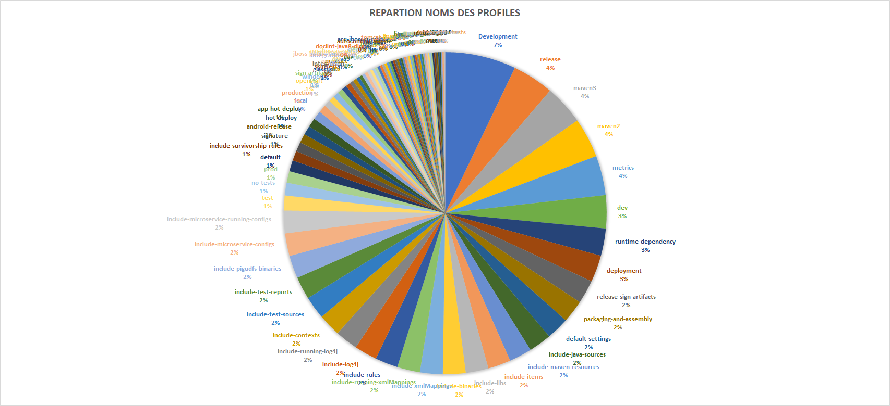
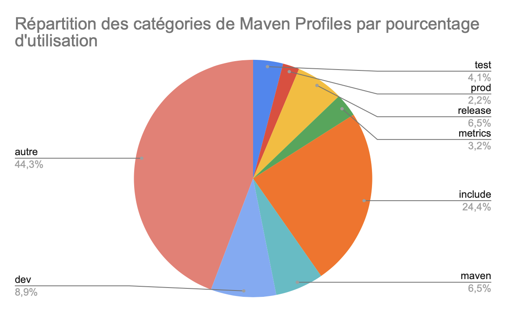
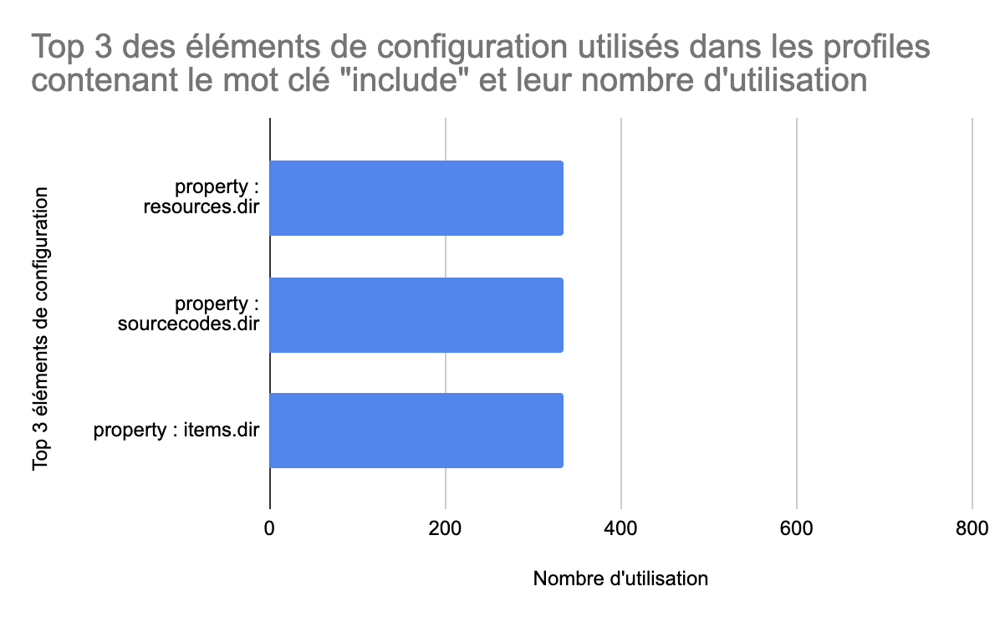
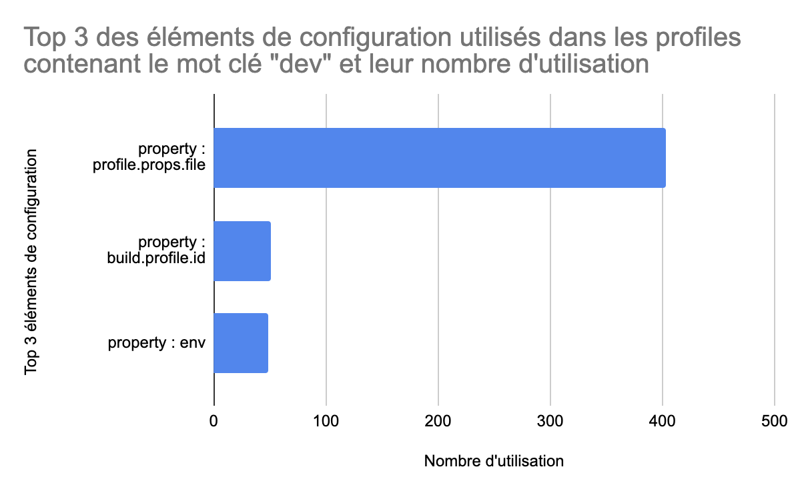
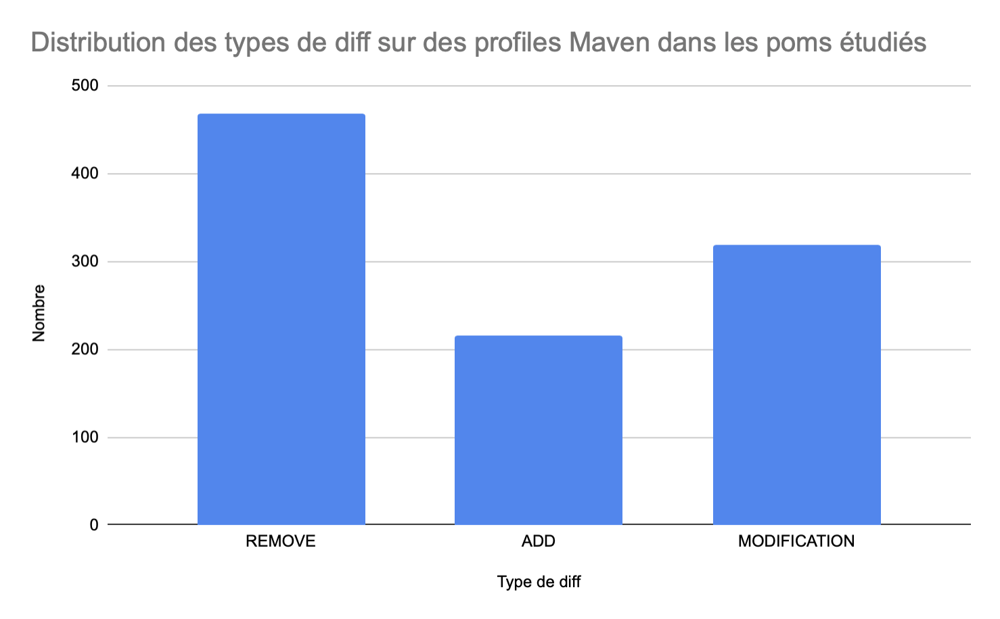
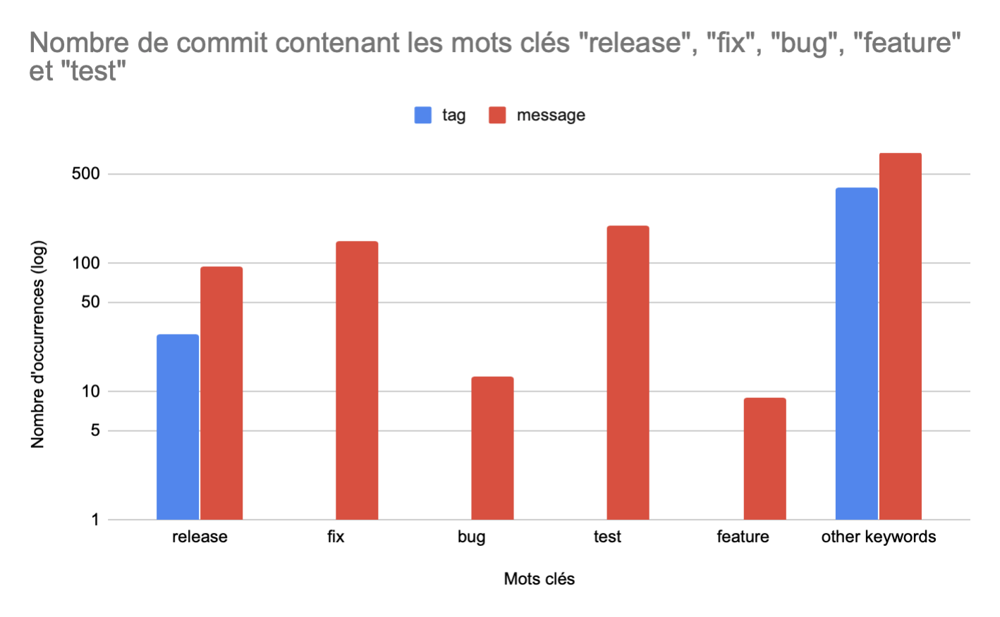
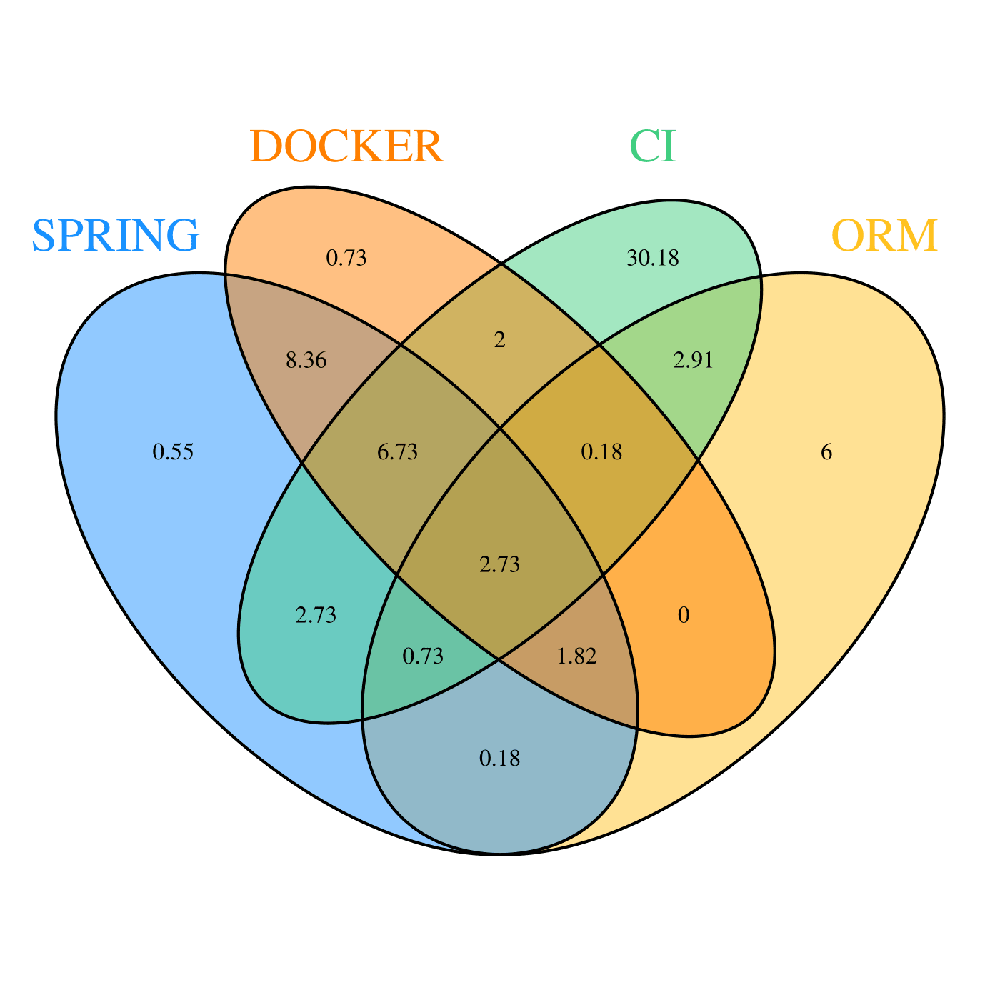
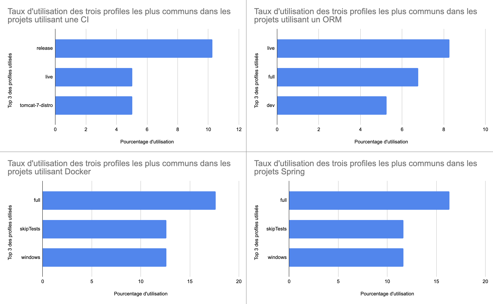
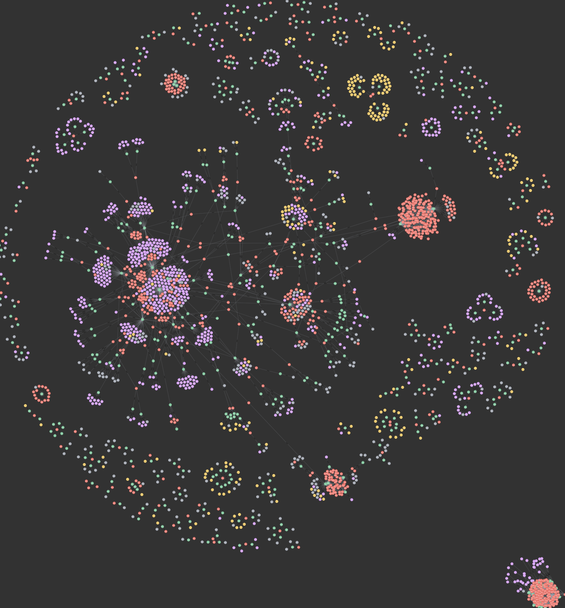
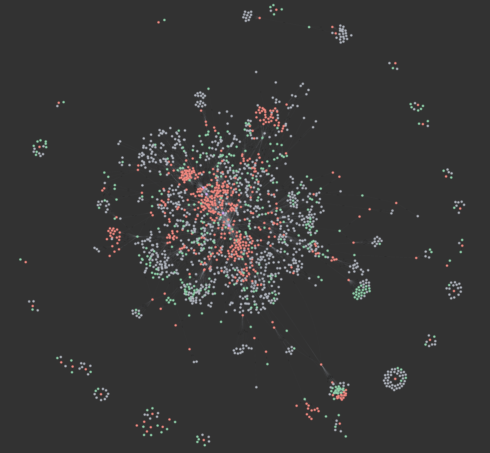

# Quels problèmes résout l’utilisation de profils Maven dans les logiciels Open Source ?

## Auteurs

Nous sommes trois étudiants en dernière année à Polytech Nice Sophia Antipolis, dans la spécialité Architecture Logicielle :

* FORAY Théo &lt;theo.foray@etu.unice.fr&gt;
* SEGURA Alexis &lt;alexis.segura@etu.unice.fr&gt;
* STROBBE Nathan &lt;nathan.strobbe@etu.unice.fr&gt;


## I. Contexte de recherche

Le sujet de notre recherche en rétro-ingénierie porte sur les *Maven profiles*. 
Maven est un outil d'automatisation et de configuration de production de projets Java, construit sous forme de document XML. La configuration passe notamment par l'utilisation d'un mécanisme propre à Maven appelé _profile_. Un *profile* permet de paramétrer certains éléments. Par exemple à spécifier l'utilisation de nouveaux plugins, de nouvelles propriétés ou encore de nouvelles dépendances. Les *profiles* peuvent être activés lors du *build*, ainsi ce mécanisme facilite la configuration et la modularité de ce dernier au sein d'un projet.

Afin d'avoir une base de projets à étudier, nous avons effectué nos recherches sur la plateforme GitHub où sont disponibles de nombreux codes sources Java qui utilisent la technologie Maven (Cf. <a href="#iii-collecte-dinformations">III. Collecte d’informations</a>).

Ce contexte de recherche est particulièrement intéressant pour nous, car nous utilisons majoritairement des technologies de l'écosystème Java, dont Maven. Nous avons donc déjà été amenés à utiliser les *Maven profiles*, et avons donc certaines intuitions quant à la question principale de notre sujet. Cela rend donc cette recherche encore plus pertinente afin de voir si ces intuitions se confirment ou non dans des projets *Open Source*, potentiellement de bien plus grande taille que nos projets. 

De plus, nous arrivons à une période charnière où la méthode DevOps est de plus en plus populaire, car elle permet d'avoir un meilleur suivi de projet, et de plus facilement maintenir la stabilité de ces derniers. Or, certains outils utilisés pour appliquer cette méthode DevOps poussent encore plus loin l'idée de configuration et d'automatisation que ce que propose Maven et ses *profiles*. Il nous paraissait donc intéressant d'étudier ces différents points à une échelle plus importante.

## II. Observations et problématique

Au cours de notre formation, nous avons eu l'occasion de rencontrer des *Maven Profiles* sur plusieurs projets, lors de stage ou à l'école. Ces *profiles* sont utilisés dans des contextes et à des fins variées. Certains permettent de configurer le binaire d'un projet pour l'utiliser dans un environnement de développement, d'autres pour générer du code ou encore lancer des tests au moment du *build*. Ce constat nous a amenés à réfléchir sur le *scope* d'un *profile*, sur sa responsabilité. La mécanique de *profiles* Maven permet de faire beaucoup de choses et nous n'avons trouvé de *guidelines* définissant concrètement les cas et domaines d'utilisation. <br/>
Ainsi nous nous sommes posé la question : **Quels sont les principaux problèmes résolus par l’utilisation des Maven Profiles ?** Une étude empirique sur un ensemble de projets _Open Source_ pourrait nous permettre peut être de trouver un ensemble de cas d'utilisation globaux.

Pour conduire cette étude, nous avons découpé la question en trois sous interrogations. 

### Caractérisation des *profiles*
En parcourant des projets Maven, nous avons pu voir la diversité qui existait dans les *profiles*, certains contextuels au projet, mais d'autres sont plus communs. Les noms qui viennent tout de suite en tête sont : "test", "prod", "dev" par exemple. Nous avons aussi remarqué par expérience que des *profiles* contextuels à des projets pouvaient utiliser des plugins/dépendances très répandues, comme `maven-surefire` pour lancer des tests ou `docker-spotify` pour générer des images Docker.
En partant de ce constat, nous pensons qu'il serait intéressant de répondre à la question : **Quels sont les différents types de Maven profiles dans les projets Open Source ?**. Ceci nous permettrait de faire l'inventaire des profils les plus utilisés et de les associer aux plugins/dépendances/propriétés qu'ils configurent.
Cette question constitue la première étape de notre recherche.

### Place des *profiles* dans l'historique des projets

Les *profiles* Maven font partie de la configuration d'un projet. De ce fait, ce n'est pas la partie qui est la plus susceptible d'être modifiée dans un code source. Nous nous sommes donc demandé **Au cours de quels événements les développeurs implémentent-ils des Maven Profiles dans un projet?**

À noter, que nous considérons ici qu'un événement peut être un ajout, une modification ou une suppression de *LoC* sur un *profile* lors d'un commit. Ces événements peuvent survenir lors d'un commit de `release`, `fix`,`bug` ,`feature` ou `test`.

### Contexte technologique

Enfin, nous avons eu une intuition sur les liens entre les *Maven profiles* et la *stack* technologique des projets dans lesquels ils sont utilisés. À une époque, les projets java étaient souvent configurés au moment du _build_. Entraînant ainsi l'utilisation des *Maven profiles* . Aujourd'hui, la dockerisation des projets tend à changer les pratiques. Nous avons plus le réflexe de construire une seule image du projet et de le configurer au moment de l'exécution via des variables d'environnement ou des configurations sur des serveurs à part. Si ces observations sont vraies alors cela signifie que la dockerisation et les *profiles* dans le POM ont un lien. De même, la mouvance DevOps entraîne la mise en place de CI sur de nombreux projets. Les *profiles* peuvent être très utiles dans une pipeline d'intégration continue, car ils permettent de lancer des phases spécifiques comme les tests, la génération de la javadoc ou encore une analyse de code. <br/>
Cette observation, couplée à notre intuition de départ nous amène à nous poser la question suivante : **L'environnement technique d'un projet influence-t-il l’utilisation des Maven Profiles ?**.


En combinant ces trois questions, nous pensons obtenir des informations de dimensions très différentes et ainsi proposer une réponse à la question générale. La première interrogation concerne la caractérisation des *profiles*, la seconde traite de leur cycle de vie au sein d'un projet et la dernière de la relation entre les *profiles* et le contexte technique d'un projet. 

## III. Collecte d'informations

La zone de recherche se situe dans un ensemble de projets *Open Source*. Nous avons décidé de choisir GitHub qui répertorie un grand nombre de projets, facile à utiliser et à chercher des dépôts et des fichiers spécifiques. GitHub propose également une API permettant de récolter facilement des informations sur des dépôts de manière plus poussée (chercher du code précis).
La totalité des données récoltées est fournie avec des instructions dans notre Readme.md.

### Recherche de POM sur GitHub

Notre objectif est d'obtenir un *dataset* assez conséquent pour pouvoir essayer d'atteindre une analyse complète de nos questions. Il faut donc rechercher sur GitHub des fichiers `pom.xml` contenant une balise `<profile>`. Cette recherche peut s'effectuer manuellement via l'interface de GitHub : 
<a href="https://github.com/search?l=Maven+POM&q=profile+filename%3Apom.xml&type=Code">https://github.com/search?l=Maven+POM&q=profile+filename%3Apom.xml&type=Code</a>
Cette requête peut également se faire de manière automatique grâce à l'API et pourra donc être intégrée dans un script automatique de récupération de ces POMs.

Cette recherche nous donne donc les résultats attendus. Cependant, l'API de recherche GitHub limite la réponse à 1000 résultats dus à la grande quantité de données qu'elle pourrait nous renvoyer. Ce qui reste assez bloquant, car cela ne nous donne pas un *dataset* assez conséquent.
Pour pallier à cette limite, nous avons expérimenté une manière d'obtenir plus de données tout en utilisant cette fonction de l'API (cf. <a href="#méthode-de-recherche-sur-github-pour-obtenir-beaucoup-de-résultats">IV. Hypothèses et Expérimentations</a>).

Ce *dataset* résultant sera utilisé pour répondre à notre première sous-question.

### Réduction de l'espace de recherche

Afin de répondre aux sous-questions suivantes, nous avons décidé de nous focaliser sur des projets ayant plus de commits (Cf. <a href="#recherche-de-statistiques-pour-filtrer-le-dataset">IV. Hypothèses et Expérimentations</a>) en se basant sur notre *dataset* de base. Cela nous a permis de réduire notre espace de recherche pour avoir des résultats plus pertinents relativement à nos questions. 
À noter que nous avons été contraints d'effectuer cette réduction, car les sous-questions 2 et 3 nécessitaient un clone des projets et que nous n'étions pas en capacité de télécharger plusieurs milliers de POM.

## IV. Hypothèses et Expérimentations

### Méthode de recherche sur GitHub pour obtenir beaucoup de résultats

Comme indiqué précédemment, l'API de GitHub limite le nombre de résultats à 1000 réponses par requête. Nous avons donc expérimenté une méthode permettant d'avoir plus de résultats. Celle-ci consiste à prendre un nouveau critère pour la recherche : un intervalle de la taille des POM (en octets). En l'appliquant et en le faisant varier, nous avons obtenu plus de résultats. 
Ainsi, lors de notre recherche, nous allons prendre un intervalle de taille de fichiers et effectuer la recherche. Si le nombre de résultats de la recherche est supérieur à 1000, nous allons effectuer une dichotomie et ainsi couper en deux l'intervalle et refaire une requête. Si le nombre de résultats est inférieur à 1000, nous pouvons agréger les résultats et continuer sur les intervalles restants. En répétant un grand nombre de fois cette technique, nous avons réussi à obtenir de nombreux POM.

### Quels sont les principaux problèmes résolus par l’utilisation des Maven Profiles ?

#### Hypothèse

Une première hypothèse que nous établissons est : Les noms des *Maven Profiles* et leur contenu vont permettre de les caractériser et de les catégoriser pour pouvoir étudier leurs usages.

#### Expérimentation

Afin de répondre à cette première sous-question, nous avons constitué une base contenant 5323 POMs possédant en tout 1942 *Maven profiles* et 7800 éléments de configuration, pour les caractériser à l'aide de différents critères. Le premier critère que nous utilisons afin de discriminer les *profiles* est leur nom, ou plus précisément leur *id*. 
Ensuite, nous avons examiné le contenu des *profiles* de ces catégories pour comprendre lesquelles étaient le plus configurées, et comment. Nous appelons ici configuration, le fait de spécifier des ```properties```, ou d'utiliser des ```dependencies``` ou des ```plugins```. 
Ces données sont enregistrées dans une base Neo4J.

#### Outils

- API GitHub : recherche des POMs (Cf. <a href="#méthode-de-recherche-sur-github-pour-obtenir-beaucoup-de-résultats">Méthode de recherche sur GitHub</a>)
- Téléchargement des sources : pour pallier à la limite de l'API de GitHub, nous avons utilisé un autre outil externe pour télécharger les fichiers sources de GitHub (cf. <a href="#viii-annexes">VIII. Annexes</a>)
- Parser XML : pour détecter les balises que nous recherchons dans les POMs, nous utilisons, à l'aide d'une dépendance Maven, une structure de données fournis par le w3c
- Spring Data / Neo4j : pour le stockage de nos données dans la base Neo4j, nous avons utilisé Spring Data qui facilite le stockage et fourni une abstraction du modèle de données pour manipuler les nœuds et les relations.


### Recherche de statistiques pour filtrer le dataset

Afin de réduire l'espace de recherche de notre premier *dataset*, nous avons décidé d'évaluer certains critères sur les dépôts git afin de déterminer un « bon » filtre de données pour notre second *dataset*. Pour cela, nous avons choisi plusieurs critères et récupéré des métriques sur les dépôts pour pouvoir faire des statistiques sur ces critères et en choisir un « bon ». Nous avons choisi ces critères : 
- Nombre de commits
- Nombre de contributeurs au dépôt
- Nombre de releases GitHub

Afin de pouvoir facilement récupérer des statistiques, nous avons utilisé un script en R. Voici la commande que nous avons utilisée pour avoir ces résultats : 
`cat results/stats.csv | cut -d ';' -f1 | ./stats.r` (indiquant `-f1`, `-f2`, `-f3` pour faire varier les critères)


Le critère intéressant ici est sur le nombre de commits. En effet, on remarque que la notion de releases est peu utilisée sur notre dataset et donc peu pertinente pour nous. Et le nombre de contributeurs varie très peu avec seulement en moyenne 5 contributeurs par projets. Nous allons donc nous concentrer sur le nombre de commits dans un projet.

Cependant, ces statistiques agrégées ne suffisent pas à correctement filtrer les dépôts par leur nombre de commits : À partir de quelle limite on peut raisonnablement choisir un dépôt ? Pour répondre à cela, nous avons décidé de calculer le décile sur ce critère : 


Ainsi, nous pouvons voir que 90% de notre *dataset* comporte plus de 407 commits. Ce qu'ils nous parez raisonnable pour réduire notre dataset, en sachant que celui et à plus de 5000 POMs, nous allons donc obtenir 500 POMs pour notre *dataset* réduit.


### Au cours de quels événements les développeurs implémentent-ils des Maven Profiles dans un projet ?

#### Hypothèse

Notre hypothèse de travail pour répondre à cette question est que les *profiles* sont créés ou modifiés lors d'événements dans un projet. Ce que nous appelons événement correspond par exemple à des commits avec des *tags* de *release*, ou encore des modifications sur des branches de type *fix* (cf. <a href="#question-2--au-cours-de-quels-événements-les-développeurs-implémentent-ils-des-maven-profiles-dans-un-projet-">V. Analyse des résultats et conclusion</a>).

#### Expérimentation

Pour vérifier notre hypothèse, nous parcourons les commits d'un dépôt et identifions ceux où les *profiles* sont impactés. Les éléments relevés sont le message de commit et le nom de la branche. De plus, nous inspectons le commit pour récupérer le tag. 

Lors de cette expérimentation, nous avons identifié plusieurs biais non négligeables sur la construction du dataset : 
- Nous nous sommes rendu compte de la difficulté d'analyser les commits touchant les *profiles*. En effet, il est assez complexe de déterminer à partir d'un *diff*, ce qui a été modifié dans un *profile* particulier. 
- Nous nous sommes rendu compte que nous n'arrivions à récupérer que des commits provenant de la branche par défaut du *repository*. 
- Nous nous sommes rendu compte que sur de nombreux commits, nous n'arrivions pas à récupérer le diff et donc à savoir si un *profile* était impacté (à cause de l'API RAW Github).
- Nous nous sommes rendu compte que n'arrivions pas à détecter les commits qui sont des merges (dans le code oui, mais dans la recherche non).
Notre *dataset* actuel est donc beaucoup plus petit que ce qu'il devrait être. Par exemple, sur certains POM nous n'avons pas identifié d'événements de modification sur les *profiles* alors qu'il y en a forcément.

#### Outils
- Spring Data / Neo4j
- jgit : bibliothèque nous fournissant les moyens de manipuler l'historique des commits d'un dépôt git et de récupérer les *diffs* de ces commits, ainsi que les autres éléments tels que les *tags* ou les *branchs*.

### L'environnement technique d'un projet influence-t-il l’utilisation des Maven Profiles ?

#### Hypothèse

Du fait de l'utilisation de certains outils externes de différents types, nous pensons que certains vont favoriser ou défavoriser l'utilisation de *profiles*. Par exemple, avec une *stack* technique utilisant Docker où on peut configurer des images, ou la configuration des *beans* dans Spring via les fichiers `properties`, cela va défavoriser l'utilisation des Maven *profiles*. Au contraire l'utilisation d'une *CI* devrait favoriser l'utilisation des *Maven profiles*, car elle nécessite plusieurs étapes de *build* particulières tels que la génération de la *javadoc* ou le lancement des tests. Les *ORM* devraient aussi être configurés par des *profiles* pour les propriétés de connexions aux bases de données par exemple.

#### Expérimentation

Afin d'évaluer cette *stack* technique, nous parcourons, sur le dernier commit, le nom de tous les fichiers du projet, pour y trouver des noms caractéristiques de certaines technologies notamment "Dockerfile", "docker-compose", ou encore certaines balises qui correspondent à des noms d'ORM dans le pom du projet.
Les technologies recherchées sont : 
- Docker : avec présence d'un dockerfile/docker-compose
- CI : avec présence d'un fichier travis.yml/circle.yml/Jenkinsfile.
- ORM : avec la présence de dépendances hibernate/spring-data/eclipse-link/open-jpa/spring-orm.
- Spring : avec la présence de dépendances spring dans le pom.

#### Outils

- Réutilisation des outils précédents

## V. Analyse des résultats et conclusion

### Question 1 : Quels sont les différents types de Maven profiles dans les projets Open Source ?

*Rappel : Les analyses de cette question ont été réalisées sur la base de données contenant 5323 POMs et possédant en tout 1942 Maven profiles avec 7800 éléments de configuration (base numéro 1).* <br/>
Nous avons choisi d'établir des catégories en fonction des noms majoritaires des *profiles*. En effet, ces derniers peuvent avoir des noms très différents, mais certains ne sont en fait que très peu utilisés comparés au nombre total de *profiles*. Les noms qui ressortaient le plus nous ont servi de catégories afin de regrouper par exemple "dev" et "development" ou encore "include-java-sources" et "include-binaries". On peut le constater sur le diagramme de répartition des noms : 



À partir de ce diagramme, nous les avons regroupés par catégorie. Nous avons fait le choix d'établir des ensembles disjoints pour ne pas avoir d'ambiguïté, c'est-à-dire que si un *profile* est dans une catégorie, il ne peut pas figurer dans une autre.

Le diagramme ci-dessous montre le résultat de nos expérimentations, en pourcentage par rapport au 1942 profiles stockés, leur répartition selon s'ils contiennent les différents termes dans leur nom.




Parmi ces catégories, nous remarquons que les différentes phases de développement sont très présentes avec les catégories ```dev``` et ```prod```. Ces *profiles* servent donc à configurer les *build* en fonction du type de phase de développement dans lequel il est utilisé. Des profiles servent aussi beaucoup à lancer des actions particulières comme ```release``` et ```test```. Ensuite, on remarque que les *profiles* sont beaucoup utilisés afin d'ajuster le build en fonction de la version de Maven voulait être utilisée. En effet, avec la catégorie ```maven```, nous avons pu regrouper des profiles nommés la plupart du temps "maven3" ou "maven2". Enfin la catégorie la plus importante, ```include``` sert elle à ajouter certaines parties très spécifiques du projet, notamment des bibliothèques, des mappings xml ou encore des fichiers de configuration. Nous ne nous attendions pas a une telle proportion de *profiles* *include* dans notre *dataset*

La deuxième expérimentation faite pour répondre à cette question nous a fourni le graphe ci-dessous, qui permet d'identifier les différents contenus des *profiles* :

{:height="400px" }

On remarque que dans toutes les catégories, sauf ```release```, les ```properties``` sont le moyen de configuration le plus configuré. Ce type de configuration permet de modifier des éléments internes au projet tandis que les ```dependencies``` et ```plugins``` vont permettre, dans le cas de l'utilisation de ces profiles d'ajouter certains éléments extérieurs. On voit donc que les *profiles* sont configurés plus souvent afin de "modifier" l'existant, dans les catégories les plus importantes sur notre *dataset*.

Nous avons aussi calculé le taux d'utilisation de chaque élément de configuration dans les POM. On remarque que dans les *profiles* de ```dev```, le taux d'utilisation de ```properties``` est relativement faible : environ une propriété. Alors que dans le graphique précédent, nous avions remarqué que les *profiles* de ```dev``` étaient ceux possédant la plus grande variété de ```properties```. Nous pouvons donc en conclure que sur notre jeu de données, les *profiles* de ```dev``` configurent des ```properties``` qui sont spécifiques au projet. On remarque aussi que le taux d'utilisation de dépendances dans les *profiles* est relativement faible, seuls les *profiles* de la catégorie ```maven``` se démarque avec environ une dépendance par POM.

{:height="400px" }

Enfin, nous avons décidé d'étudier certaines de ces catégories en détail. Nous avons donc récupéré les trois éléments de configuration (```properties```,```dependencies``` et ```plugins```) les plus utilisés dans chaque catégorie.

{:height="400px" }
<br/>
{:height="400px" }
<br/>
{:height="400px" }

Pour ```metrics```, on remarque que seuls les deux premiers éléments sont utilisés. Ce sont les plugins *pmd* et *findbugs* qui permettent de calculer des métriques de code. La catégorie de *profiles* ```metrics``` est donc bien définie autour de ces éléments.

Nous avons trouvé intéressant d'étudier la catégorie ```dev```, car nous avons vu précédemment qu'elle contenait une grande variété d'éléments. Les trois les plus utilisés sont des propriétés. Nous n'avons pas réussi à comprendre la sémantique exacte de leur utilisation mis à part la première qui permet de spécifier un fichier de properties. Nous pensons donc que ces éléments sont aussi spécifiques aux projets, car leur utilisation n'est pas très fréquente. Globalement, cela rejoint l'idée que le contenu d'un *profile* `dev` dépend fortement du projet.

Enfin, pour la catégorie ```include```, nous avons trouvé plusieurs `properties` permettant de spécifier des dossiers spécifiques, ce qui paraît logique, car d'après leurs noms, ces *profiles* permettent d'inclure des ressources dans le *build*. Nous avons trouvé surprenant que les `properties` aient le même nombre d'utilisations. Nous avons donc observé le graphe des POMs utilisant des *profiles* `include`. 

{:height="600px" }

En rouge les POMs et en vert les *profiles*. On remarque que les POMs sont liés à de nombreux *profiles*. Nous pensons donc que nous avons récupéré un groupe de projets semblables qui utilisent tous des configurations similaires. C'est donc peut-être un biais sur notre base de données.

### Question 2 : Au cours de quels événements les développeurs implémentent-ils des *Maven Profiles* dans un projet ?
*Rappel : Les analyses de cette question ont été réalisées sur la base de données contenant 550 POMs (base numéro 2).* <br/>
*Attention, les résultats présentés dans cette section sont biaisés par les problématiques détaillées dans la section <a href="#quels-sont-les-principaux-problèmes-résolus-par-lutilisation-des-maven-profiles-">IV. Hypothèses et Expérimentations</a> de cette question.*

Du fait des problèmes rencontrés lors de l'expérimentation, nous ne pouvons pas exploiter les informations sur les branches des commits et sur leur nature (merge ou non merge).
Nous pouvons utiliser le tag et le commit message.

De plus, nous pensons qu'il serait préférable de ne pas prendre en compte le type de *diff* (ajouts, modifications ou suppressions de lignes de codes dans un *profile*), car il a été très complexe d'évaluer cette métrique et qu'en réalisant la distribution de ces types sur notre jeu de données on obtient le diagramme suivant : 

{:height="400px" }

Or on voit ici qu'il y a plus de *REMOVE* que d'*ADD* donc il y a une incohérence dans le relevé des données. Nous ne pouvons donc pas poursuivre cette piste.

Nous avons donc étudié les messages de commit et les *tags*. En cherchant les événements suivants : `release`, `fix`, `feature`, `bug`, `test`.
{:height="400px" }
<br/>
Comme on peut l'imaginer, les *tags* de `fix`, `bug` et `test` seraient étonnants, et effectivement, on n'en trouve aucun. Uniquement le tag de `release`, qui lui a du sens, est trouvé. 
Pour ce qui est des messages de `commits`, les modifications des *profiles* arrivent dans les mêmes proportions sur des `commits` contenant `release`, `fix`, `test` dans leur message, mais moins pour contenant `bug` ou `feature`. On peut interprété cela comme montrant que les modifications (pouvant être des créations ou suppressions) sont moins faites lors d'un commit lié à un `bug` ou à l'ajout d'une `feature`. 
Au vu du nombre de commits n'utilisant pas ces mots clés dans leur tag ou message, les évènements que nous pensions majoritaires ne représentent qu'une petite partie sur notre jeu de données.

Ainsi, d'après nos résultats nous estimons qu'il est légitime de penser que nous ne pouvons pas traiter cette question correctement et ainsi répondre à nos hypothèses. En effet, notre *dataset* ne permet pas de correctement analyser les différents concepts qu'on essaie d'en extraire.


### Question 3 : L'environnement technique du projet influence-t-il l’utilisation des Maven Profiles ?
*Rappel : Les analyses de cette question ont été réalisées sur la base de données contenant 550 POMs (base numéro 2).* <br/>
Pour rappel, tous les POMs analysés ici possèdent des *profiles*. Nous avons structuré le résultat de cette question en deux parties principales. 

Dans la première partie, nous avons calculé le pourcentage de POMs qui utilisent chaque technologie parmi des technologies de CI, Docker, le framework Spring ou au moins un des ORMs importants de l'écosystème Java. Pour avoir les différents ensembles en fonction des usages des technologies, nous avons représenté ces résultats sous forme de diagramme de Venn : 

{:height="500px" }

Ici figure donc le détail par technologie seule, mais aussi toutes les intersections entre les ensembles. 
Tout d'abord, en additionnant ces pourcentages, on remarque que **65,8%** des 550 dépôts que nous analysons utilisent seules ou plusieurs de ces technologies. 
Ensuite contrairement à ce à quoi nous nous attendions,  Docker est la deuxième technologie la plus utilisée dans notre *dataset* selon notre analyse : **22,5%** des dépôts possèdent au moins un Dockerfile ou un docker-compose. 
Dans l'ensemble, les outils de type CI sont utilisés par presque un projet sur deux (**48,18%**). Une intuition pour expliquer cela peut être que les *profiles* peuvent par exemple être utilisés dans les *pipelines*.

La deuxième partie des résultats de cette question est le nombre moyen de *profiles* dans les POMs des dépôts utilisant les technologies que nous recherchions. Nous avons ici aussi eu recours à un diagramme de Venn pour visualiser tous les ensembles :

{:height="500px"}

Les résultats de cette analyse vont à l'inverse de notre intuition. Car quand Docker est utilisé dans un projet, le nombre de *profiles* moyens est tout à fait comparable aux taux de *profiles* des autres technologies, si ce n'est ORM, qui possède relativement peu de *profiles*.
Cependant, pour la CI notre intuition était bonne, car le nombre de *profiles* moyens est toujours supérieur à 1.

Enfin, nous avons voulu comprendre quels sont les *profiles* les plus utilisés en fonction des technologies, pour comprendre le type d'utilisation des *profiles* avec celles-ci.

{:height="600px"}

Cette question s'est donc confirmée être pertinente, car on constate une corrélation entre la *stack* technique d'un projet et l'utilisation des *profiles*. En effet, les technologies utilisées influencent le nombre, mais aussi le type de *profiles*. Par exemple avec CI, la configuration de la release ou encore la distribution du serveur de container sont très importantes, alors que pour Docker et Spring, l'omission des tests ou encore l'OS de la machine hôte (par exemple Docker pour Windows) vont être des critères importants. Concernant les projets avec des ORM, nous avions l'intuition qu'ils utilisaient plusieurs *profiles* pour configurer leur connexion à la base de données, en *dev* et en *prod*, mais aussi les *drivers* SQL. L'étude sur notre *dataset* confirme notre intuition, on voit que *dev* arrive en troisième position et en étudiant les profiles n'apparaissant pas dans le top 3, nous trouvons beaucoup de `development`, `postgres` ou encore `MySQL`.
Ceci nous amène à conclure que sur notre jeu de données, les technologies impactent les *profiles* utilisés dans les POMs.

### Conclusion

Dans la première question, nous avons pu identifier les familles de *profiles* les plus utilisées sur un ensemble de 5300 poms. Nous avons eu des surprises sur des catégories comme *include* qui est utilisé par presque un quart des projets. Nous avons ensuite tenté de caractériser ces familles de *profiles* par utilisation de plugins, properties et dependencies. Pour beaucoup de POMs, les *profiles* sont utilisés dans le cycle de vie du projet : *dev*, *release*, *test*. Grâce aux noms des *profiles* nous avons pu déterminer le type de problème qu'ils résolvent.

Dans la question deux, nous avons eu du mal à construire une expérience et un *dataset* représentatif de la réalité. Beaucoup de biais nous ont empêchés de conduire une étude objective. Cependant, nous avons essayé d'apporter des pistes de réflexion grâce à ces résultats. Sur les 550 poms étudiés dans cette question, nous avons remarqué que dans près de **10%** des commits liés aux *profiles*, il est question de *release*. Ceci rejoint notre hypothèse qui lie les modifications de *profiles* à des événements particuliers du cycle de développement.
Nous pensons que cette question, de par sa complexité, pourrait être l'objet d'un projet d'étude à part entière.

Enfin dans la question trois, notre démarche a été plus fructueuse, car nous avons bien réussi à identifier les technologies utilisées dans les projets contenant les POMs étudiés. Ceci nous a donc permis de les mettre en perspective avec nos hypothèses et de nous rendre compte qu'elles n'étaient pas toutes valides sur notre jeu de données. Par exemple, nous pensions que dans les projets dockerisés, les développeurs utilisaient moins de *profiles*, mais ce n'est pas le cas. Sur la partie intégration continue, nous avions eu l'intuition que les *profiles* seraient utilisés et c'est le cas, **48%** des POMs étudiés ont une CI et ils ont en moyenne entre 1 et 3 *profiles*.

Nous pouvons donc apporter une réponse à notre question générale **Quels sont les principaux problèmes résolus par l’utilisation des Maven Profiles ?** sur les projets étudiés. Les problématiques auxquelles répondent les *profiles* sont principalement : inclure des éléments dans le build d'un projet, configurer les différents moments du cycle de développement d'un projet (dev, release, test) ou encore lancer des outils des outils particuliers sur le code (metrics). Nous n'avons pas trouvé de technologie impactant leur utilisation de manière négative dans le jeu de données étudiées, ce qui nous laisse penser que les problématiques que les *profiles* résolvent sont orthogonales aux technologies. Cependant, certaines technologies peuvent amener à utiliser plus de *profiles*, c'est notamment le cas de l'intégration continue, ou à utiliser des *profiles* particulier, comme avec les ORM et les *profiles* correspondant aux drivers SQL.

En ce qui concerne les perspectives de l'étude, il serait intéressant de retravailler la question 2. Pour améliorer la fiabilité de nos résultats, nous pourrions contacter des développeurs de projets que nous avons étudiés pour leur demander pourquoi ils ont choisi les *profiles* qu'ils ont implémentés et dans quel but. Ce serait aussi un bon moyen de comprendre pourquoi autant de projets utilisent des *profiles* d'`include`. Nous pensons aussi que d'autres informations intéressantes pourraient être extraites de nos bases de données. 

Pour terminer, nous avons beaucoup appris sur la manière dont une étude doit être conduite lors de ce projet. Nous nous sommes rendu compte de la nécessité de critiquer nos résultats et de prendre du recul vis-à-vis de ces derniers pour mieux les analyser. Les conclusions doivent toujours être mises en perspectives avec le jeu de données étudié et les biais connus.

## VI. Outillage

Au cours de cette étude, nous avons développé plusieurs outils pour récolter et analyser des projets dotés de *Maven Profiles*.

- Definition-tool (Java/Spring) : L'outil definition-tool permet de trouver des POMs de projets via l'API github. Ces poms sont parsés et analysés (contenu des profils : plugins, dépendances et properties), les résultats sont insérés dans une base de données Neo4J.
- Script Analyse (Python) : Ce script utilise les bases de données récupérées par l'outil définition-tool afin de récupérer des métriques sur les repositories des projets dont nous avons récupéré les poms.
- Event-search-tool (Java/Spring) : Cet outil clone les projets sélectionnés précédemment avec le script d'analyse Python pour analyser les commits qui ont impacté les profils dans le pom. L'outil permet aussi de définir la stack technologique utilisée par le projet. Les résultats produits par cet outil sont stockés dans une base de données Neo4j.

Nous avons travaillé sur la reproductibilité de notre étude. Ainsi, nous fournissons une documentation complète permettant de reproduire nos expériences (cf. README.md dans notre code). À noter que les données récupérées sur l'API Github par l'outil "definition-tool" varient. En effet, nous utilisons une fonction de l'API qui renvoie du code indexé en permanence (lorsque les développeurs commit). Il est donc impossible de reconstruire le même *dataset* que nous. C'est pourquoi nous mettons à disposition nos deux bases de données Neo4J sous forme de volumes docker. Ces dernières peuvent être utilisées via le docker-compose fourni dans le projet.

### Diagramme de Venn

Lors de l'analyse des résultats, nous avons voulu faire un diagramme de Venn pour avoir une répartition de l'utilisation des certains profils pour les quatre technologies étudiées. Nous avons donc effectué des requêtes Cypher (Cf. <a href="#viii-annexes">VIII. Annexes</a>), puis déterminer dans quel ensemble se trouvaient les données pour le diagramme. C'est pourquoi nous avons utilisé un outil externe<a href="#vii-références">[3]</a> pour faire cette séparation des données. Enfin, nous avons utilisé un script en R pour visualiser ce diagramme avec les données issues du script.


## VII. Références

1. API GitHub : <a href="https://developer.github.com/v3/">https://developer.github.com/v3/</a>
2. Neo4j : <a href="https://neo4j.com/docs/cypher-refcard/current/">https://neo4j.com/docs/cypher-refcard/current/</a>
3. Générateur diagramme de Venn : <a href="http://bioinformatics.psb.ugent.be/webtools/Venn/">http://bioinformatics.psb.ugent.be/webtools/Venn/</a>

## VIII. Annexes

### Vues de nos bases de données

Visualisation de notre base de données numéro 1 : <br/>
{:height="600px"}

Visualisation de notre base de données numéro 2 : <br/>
{:height="600px"}

### Téléchargement des POM

`https://raw.githubusercontent.com/<owner>/<repo>/<branch>/<filepath>`

### Routes pour les requêtes vers l'API GitHub

`https://api.github.com/search/code`
`https://api.github.com/repos/:owner/:repo`
`https://api.github.com/repos/:owner/:repo/stats/contributors`

### Requêtes Cypher (Neo4j)

Pour assurer une meilleure reproductibilité, les requêtes utilisées sur nos bases de données sont disponibles ci-dessous avec de brèves explications.

#### Question 1 : Quels sont les différents types de Maven profiles dans les projets Open Source ?
Les requêtes effectuées pour répondre à cette question ont été faites sur la base de données correspondante.
Les requêtes pour catégoriser les profiles en utilisant leur nom sont de ce type : 
`MATCH (p:Pom)-[r]->(n:MavenProfile) WHERE toLower(n.name) CONTAINS 'release' AND NOT(toLower(n.name) CONTAINS 'dev') AND NOT(toLower(n.name) CONTAINS 'maven') AND NOT(toLower(n.name) CONTAINS 'include') AND NOT(toLower(n.name) CONTAINS 'metrics') AND NOT(toLower(n.name) CONTAINS 'prod') AND NOT(toLower(n.name) CONTAINS 'test') return count(n)`
Cette requête renvoie le nombre de profiles contenus dans la catégorie "release". Pour les autres catégories, il convient de changer ce que doit contenir la variable `n`, de même que ce qu'elle ne doit pas contenir en conséquence pour avoir des ensembles disjoints.

Afin d'obtenir les statistiques de configuration des profiles, nous avons effectué ce type de requêtes : 
`match (n:MavenProfile)-[d:PLUGINS]->() where toLower(n.name) CONTAINS 'metrics' AND NOT(toLower(n.name) CONTAINS 'release') AND NOT(toLower(n.name) CONTAINS 'dev') AND NOT(toLower(n.name) CONTAINS 'maven') AND NOT(toLower(n.name) CONTAINS 'include') AND NOT(toLower(n.name) CONTAINS 'prod') AND NOT(toLower(n.name) CONTAINS 'test') return count(d)`
En faisant varier le type de la variable `d`, de `PLUGINS`, à `DEPENDENCIES` et `PROPERTIES`. De même que pour analyser la catégorie, il faut faire varier le `name` de la variable `n`, et les négations en conséquence, pour conserver des ensembles disjoints.

Nous voulions obtenir le nombre d'utilisations de plugins pour certains *profiles*. Pour simplifier, nous allons indiquer ici `$PROFILE` comme variable, où nous avons cherché tous les différents profils utilisés dans la requête précédente.

`match (n:MavenProfile)-[r]-(a:MavenPlugin) WHERE n.name CONTAINS '$PROFILE' return n.name, sum(r.weight) as usage`

#### Question 2 : Au cours de quels événements les développeurs implémentent-ils des Maven Profiles dans un projet ?

Nous voulions rechercher le nombre d'événements contenant des mot-clés spécifiques comme `release`,`fix`,`bug`,`test`,`feature` que nous allons nommer `$KEYWORD` dans nos requêtes.

La requête suivante permet de compter le nombre d'occurence avec un événement contenant un mot-clé : 
`MATCH (m:Pom)-[l:EVENTS]->(e:Event) WHERE toLower(e.tag) CONTAINS '$KEYWORD' return COUNT(e)`

La requête suivante permet de compter le nombre d'apparition pour un événement de type ADD/MODIFY/REMOVE de *LoC* :
`MATCH (m:Pom)-[l:EVENTS]->(e:Event) WHERE e.diffType='ADD' RETURN COUNT(e)`


#### Question 3 : L’environnement technique du projet influence-t-il l’utilisation des Maven Profiles ?

Nous avons fait deux requêtes ici pour les quatre technologies donc huit requêtes. Pour simplifier, nous allons indiquer ici `$STACK` comme variable qui peut prendre comme valeur `DOCKER`, `ORM`, `CI`, `SPRING`.

La requête suivante permet de trouver tous les poms qui sont liés à une technologie.

`MATCH (t:Technology)--(p:Pom)--(mp:MavenProfile) WHERE t.stack='$STACK' RETURN DISTINCT p`

La requête suivante permet de trouver les POM qui sont associés à une technologie en particulier et de compter le nombre de profils associés à chaque POM.

`MATCH (t:Technology)--(p:Pom)-[r]-(:MavenProfile) WHERE t.stack = '$STACK' WITH count(DISTINCT r) as nbMavenProfile, p RETURN p as Pom, nbMavenProfile`

### Références

Software evolution in open source projects - a large-scale investigation - Koch - 2007 - Journal of Software Maintenance and Evolution: Research and Practice

A Unified Framework for the Comprehension of Software’s Time Dimension

Cours de RIMEL et interventions de Sébastien MOSSER et Xavier BLANC.

{:height="200px" }


