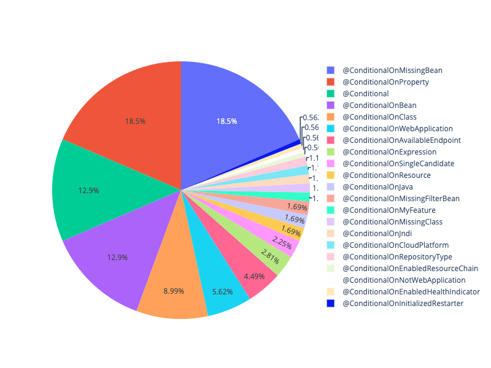
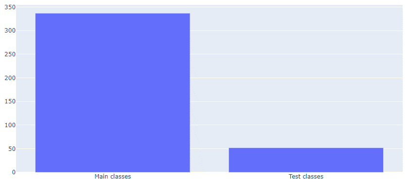
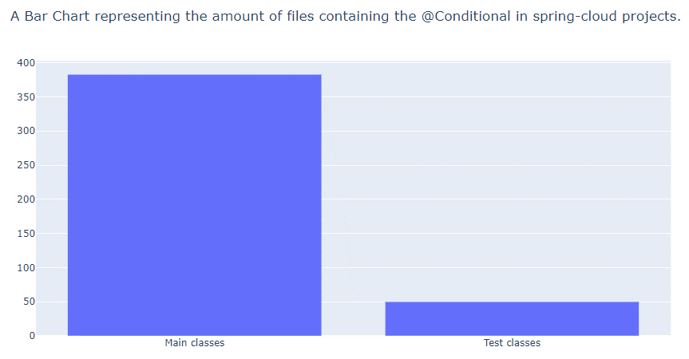
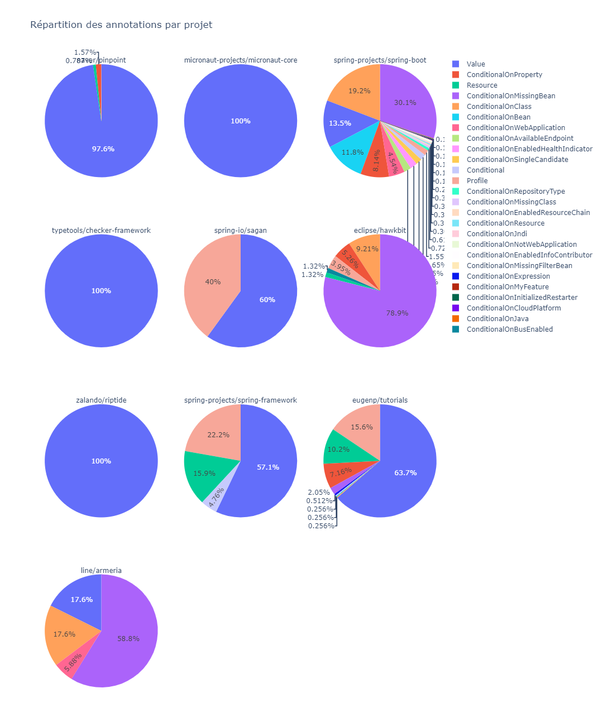
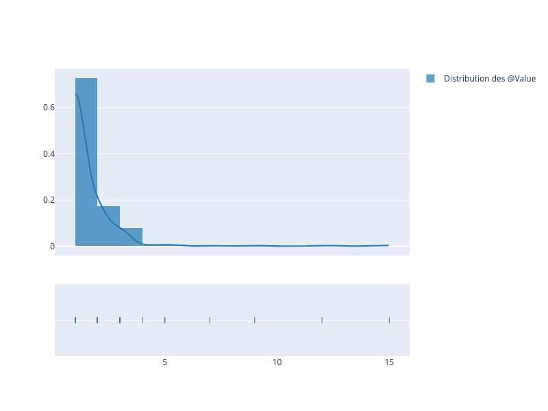

## Auteurs

Nous sommes quatre étudiants en dernière année à Polytech Nice Sophia en architecture logicielle :

* Laura Lopez &lt;laura.lopez1@etu.unice.fr&gt;
* Alexis Gardin &lt;alexis.gardin@etu.unice.fr&gt;
* Hugo Croenne &lt;hugo.croenne@etu.unice.fr&gt;
* Mathieu Paillart &lt;mathieu.paillart@etu.unice.fr&gt;

## I. Contexte de la récherche

Spring est un framework open-source qui facilite la mise en place et le développement d'applications Java. Son fonctionnement se base sur un système d'annotations. 

A l'heure actuelle, divers annotations permettent d'effectuer de la variabilité dans Spring.

Cependant, au tout début, l'annotation @Profile introduit dans la version 3.1 de Spring est la première à introduire un mécanisme de configuration.
En effet, avec cette annotation, nous pouvons activer des profils différents (un profil dev, un profil prod par exemple). C'est une façon d'effectuer de la variabilité basée uniquement sur des vérifications booléennes,
en lien avec les fichiers *properties* de Spring.

Cette annotation a part la suite été raffinée, notamment dans la version 4 de Spring.

L'annotation de paramétrage *@Conditional* a été introduite dans la version *Spring 5.2.3* afin de répoondre à des problématiques de condition de chargement de classe en fonction d'un contexte. 

bullshit sur la variabilité.
les nouvelles/anciennes annotations 
spring
contexte : 

## II. Observation générale

1. Commencez par formuler une question sur quelque chose que vous observez ou constatez ou encore une idée émergente. Attention pour répondre à cette question vous devrez être capable de quantifier vos réponses.
2. Préciser bien pourquoi cette question est intéressante de votre point de vue et éventuellement en quoi la question est plus générale que le contexte de votre projet \(ex: Choisir une libraire de code est un problème récurrent qui se pose très différemment cependant en fonction des objectifs\)
Cette première étape nécessite beaucoup de réflexion pour se définir la bonne question afin de poser les bonnes bases pour la suite.

Nous avions tous au sein de l'équipe déjà utilisé Spring lors de projets Polytech, mais aucun de nous n'avais utilisé l'annotation *Conditional* et nous étions peu qualifiés sur les outils de paramétrage de Spring. La première question émergeant de nos réflexions était donc :

**Comment les outils de paramètrage de Spring sont t-il utilisés et à quelle fréquence ?**

Cette question d'ordre général a été notre première étape afin d'orienter nos recherches vers d'autres questions plus précises. Au fil de nos découvertes, nous avons pu cibler un ensemble de nouvelles questions qu'il nous semblait pertinent et intéressant d'étudier.

### Comment l'annotation @Conditional est-elle utilisée ? 

N'étant pas familier avec l'annotation, il était important pour nous dans un premier temps de rassembler le plus d'informations possible sur *@Conditional*. Pour cela, nous nous sommes concentrés sur sa présence au sein des fichiers, des projets et sur sa fréquence d'apparition au sein d'un même fichier.
L'annotation de paramétrage que l'on appelle *@Conditional* possède plusieurs déclinaisons : *@ConditionalOnMissingBean*, 

Nous souhaitons également nous intéresser à la fréquence d'usage de chacune de ces annotations au sein de projets afin d'en déduire qu'elles sont les annotations les plus utilisées et dans quel contexte d'usage. 

Apportant un ensemble de questions sous-jacentes
-> dans quels fichiers ? -> configuration
-> dans quels projets ? -> frameworks
-> combien de fois par fichiers ?  -> rarement seule
-> quelle déclinaison de l'annotation est la plus utilisée ?  -> on missing bean

### Comment et à quelle fréquence est-elle testée ? 

Il nous paraissait d'autre part intéressant d'étudier la fréquence de test de l'annotation étudiée. En effet, cela nous permettrait de nous renseigner sur la facilité de tests de l'annotation, mais également potentiellement en déduire que son utilisation est une bonne pratique et n'affecte pas la couverture de tests d'un projet. D'autre part, nous trouvions également intéressant de savoir si celle-ci était utilisée au sein de fichiers tests dans le but de tester d'autres fonctionnalités afin d'avoir une vue d'ensemble plus large de son utilisation. 

### Quelle annotation de configuration est la plus utilisée parmi les existantes (Conditional, Profile, Value, Ressources) ? 

Nous avons pu remarquer lors de nos recherches, l'existance de plusieurs annotations de configuration autres que *@Conditional*. Nous avons tout de suite pensé qu'il serait intéressant de la mettre en corrélation avec ses équivalents. Les autres annotations sont : 
1
- *@Profile* qui est le prédécesseur de *@Conditional*, cette annotation est apparue dans *Spring 3.1* et est principalement utilisée afin de gérer des profils définit selon des fichiers de configuration (par exemple un fichier *".properties*). Un exemple d'utilisation serait la mise en place de profils de développement (dev), production (prod) et test. Le type de *Bean* chargé pourrait ensuite dépendre du profil sélectionné. 
- *@Ressource* 
- *@Value* cette annotation a pour but d'assigner des valeurs à des variables et des paramètres de méthodes.

Il serait intéressant dans le cadre de cette étude d'étudier la fréquence d'utilisation de chacune de ces annotations, de constater dans quel type de projet elles apparaissent le plus souvent et de constater comment elles sont utilisées au sein de ces projets. 

### Comment est utilisée l'annotation @Value ? 

Lors de nos recherches, une seconde annotation a particulièrement attiré notre attention, il s'agit de l'annotation *@Value*. Celle-ci peut être utilisée à la fois au niveau de méthodes, de paramètres de méthodes, de variables de classes. 

Sa modularité et la diversité de sa portée nous a amenés à nous demander si son mode d'utilisation se confirmait à du *tangling* (signifiant enchevêtré) ou du *spreading* (signifiant diffusé). 

## III. Collecte d'informations

N'étant pas familiers avec les annotations de paramétrage de Spring, nous avons durant cette phase essayés de nous documenter autant que possible.
Pour cela, nous avons lu plusieurs articles qui nous ont permis d'être plus en phase avec les concepts de rétro-ingénieurie et de ré-utilisabilité du code. Ces concepts nous ont apporté une approche différente de la tâche d'analyse, notamment en mettant en avant des processus d'automatisation. Les articles que nous avons trouvés particulièrement pertinents sont les suivants : 'Mining Implicit Design Templates for Actionable Code Reuse', 'Are Developers Aware of the Architectural Impact of Their Change', 'Titan: A Toolset That Connects Software Architecture with Quality Analysis' et son listés dans les références. 
Nous avons également longuement lu la documentation fournie par Spring, principalement au niveau de l'utilisation des annotations. Nous avons également étudié de nombreux projets hébergés par Spring sur Github. Nous avons pu trouver un grand nombre d'informations notamment au niveau des fichiers de *.changelog*, *release notes* ou au niveau des messages de *commits* des développeurs. Ces informations étaient d'ordre plus techniques, elles nous ont permis de comprendre à plus fin grain les problématiques relatives à l'utilisation de l'annotation et son utilité au sein de projets. 

## IV. Hypothèses émises et expériences réalisées

1. Il s'agit ici d'énoncer sous forme d' hypothèses ce que vous allez chercher à démontrer. Vous devez définir vos hypothèses de façon à pouvoir les mesurer facilement. Bien sûr, votre hypothèse devrait être construite de manière à vous aider à répondre à votre question initiale. Explicitez ces différents points.
2. Test de l’hypothèse par l’expérimentation. 1. Vos tests d’expérimentations permettent de vérifier si vos hypothèses sont vraies ou fausses. 2. Il est possible que vous deviez répéter vos expérimentations pour vous assurer que les premiers résultats ne sont pas seulement un accident.
3. Explicitez bien les outils utilisés et comment.
4. Justifiez vos choix.

### Comment l'annotation @Conditional est-elle utilisée ?

#### Hypothèse n°1 : L'annotation @Conditional est utilisée dans des fichiers de configuration. 

Nous avions l'intuition que l'annotation devait être utilisée principalement pour de la configuration de projets. Puisque celle-ci offre notamment la possibilité de charger des Bean en fonction de conditions établies, cela pourrait parfaitement correspondre à 

#### Expérimentation

Afin de prouver notre intuition, nous allons relever la fréquence d'apparition de l'annotation dans différents fichiers au sein des différents projets du *dataset*. Une fois les fichiers relevés, nous allons parser leur nom afin d'isoler les mots clefs "Configuration", "Config", "Conf". Cela nous permettrai d'en déduire le pourcentage de répartition de l'annotation au sein des fichiers de configuration au sein du dataset.

#### Hypothèse n°2 : L'annotation @Conditional est particulièrement utilisée dans les frameworks. 

Nous avions l'intuition que grâce à son apport fonctionnel, l'annotation serait particulièrement utilisée au sein de *frameworks* car elle facilite l'adaptabilité. Pour cela, nous allons sélectionner un ensemble de projets différents : *Frameworks*, *API*, bibliothèques, plateformes, etc. Nous allons ensuite relever la fréquence d'apparition de l'annotation au sein de ces projets et corréler les résultats avec le type de chaque projet. Cela nous permettra d'établir s'il y a bien une distinction significative de fréquence d'apparition de l'annotation de paramétrage.

[dire que quand l'annotation apparaît une fois on prend le fichier, mais potentiellement y en a plein à l'intérieur]

### Comment et à quelle fréquence est-elle testée ?

#### Hypothèse : L'annotation Conditional est souvent testée lorsqu'elle est utilisée. 

Ce questionnement nous permettrait d'obtenir des informations concernant la facilité de test de l'annotation, mais également si il est fréquent de tester une annotation de paramétrage et éventuellement comment celle-ci est testée. Au vue de sa fonction déterminante pour le chargement d'un *Bean*, nous avons émis l'hypothèse que *@Conditional* est généralement testée lorsqu'elle est utilisée.

#### Expérimentation

Afin de pouvoir valider notre hypothèse, nous allons séparer les fichiers des projets testés en fonction de leur package. Nous savons que pour les fichiers Java, le code source est compris dans un package *'src'* et les tests dans un package *'test'*. Nous savons également que les mots clef "Test" et "Tests" sont par convention utilisés afin de nommer les fichiers contenant des tests. Grâce à ces deux conventions, nous allons pouvoir isoler les fichiers sources des fichiers tests et procéder à deux analyses de la présence de l'annotation *@Conditional*. Nous comparerons ensuite sa présence dans les deux types de fichiers différents afin de déduire la fréquence de test. 
Nous pourrons selon les résultats obtenus effectuer d'autre recherches, comme par exemple quelle déclinaison de l'annotation est la plus testée. Nous envisageons également d'étudier manuellement au sein d'une sélection de fichiers, comment est utilisée l'annotation au sein des fichiers.

### Quelle annotation de configuration est la plus utilisée parmi les existantes (Conditional, Profile, Value, Ressources) ? 

#### Hypothèse : La répartition des annotations de paramétrage n'est pas homogène.

#### Expérimentation

### Comment est utilisée l'annotation @Value ? 

#### Hypothèse n°1 : L'annotation @Value tangling ou spreading

Le taux de @Value utiliser dans des if

#### Expérimentation

#### Hypothèse n°2 : L'annotation @Value tangling ou spreading

#### Expérimentation

#### Hypothèse n°3 : L'annotation est fréquemment utilisée au sein de projets lambdas, mais moins utilisée que *@Conditional* au sein de librairies.

La je vais, par projet, regarder la répartition des Annotation @Conditional et Autre pour essayer de classifier les libs, des projets concrêts
pour voir si on peut dire
Sur les 14 projet analyser le taux de @Conditional était Superieur pour les libs et @Value pour les projet concret

#### Expérimentation

## V. Ressources utilisées

Afin de pouvoir fournir des réponses à nous questions, nous avons constitué un *dataset* de projets Java utilisant Spring. Pour cela, nous avons procédé en deux étapes. 
Tout d'abord, le premier *dataset* était constitué uniquement de projets Spring. Ne sachant pas comment l'annotation était utilisée et son utilité précise au sein de projets, nous pensions qu'acquérir des données de reneignement au niveau du créateur de l'annotation pourrait être très enrichissant pour cette étude. Pour cela, nous avons utilisé un ensemble de projets hébergés par Spring, décrit dans le tableau suivant.

| Organisation                  | Nombre de projets        | 
|-----------------------------|----------------------|
| Spring Projects             | 48 |
| Spring Cloud             | 63 |

Nous avons par la suite constitué un second *set*, uniquement constitué de projets utilisant Spring mais n'appartenant pas à Spring. En effet, se limiter aux projets Spring n'aurait pas reflété l'utilisation réelle de l'annotation au sein de projets lambdas. Nous les avons classés dans le tableau suivant en fonction de leur type.

| Frameworks                  | Bibliothèques        | Autres                            |
|-----------------------------|----------------------|-----------------------------------|
| zkoss/zk                    | permazen/permazen    | naver/pinpoint                    |
| typetools/checker-framework | zalando/riptide      | jeremylong/DependencyCheck        |
|                             | jmrozanec/cron-utils | micronaut-projects/micronaut-core |
|                             | line/armeria         | debezium/debezium                 |
|                             | INRIA/spoon          | spring-io/sagan                   |
|                             |                      | eclipse/hawkbit                   |
|                             |                      | eugenp/tutorials                  |

La récupération des *dataset* a été réalisée depuis la plateforme Github, hébergeur de projets open-source fonctionnant avec le gestionnaire de version Git. La plateforme contient des milions de projets qui nous ont permis d'établir un dataset complet et exhaustif. 

## VI. Technologies utilisées 

### Jupyter Notebook 

Afin d'optimiser nos recherches, nous les avons automatisées à l'aide de scripts en Python. Le développement python était effectué sur l'outil Jupyter Notebook. Nous avons choisi cette application, car elle apportait plusieurs avantages :
* la visualisation des scripts et des résultats d'exécution directement dans un navigateur web
* la mémoire en cache des exécutions des scripts, ce qui a permi d'accélérer le développement, car les scripts n'ont pas besoin d'être relancés à chaque nouvelle exécution
* les scripts partagés avec Jupyter Notebook Collaboration au sein desquels le stockage des projets clonés se fait directement dans le cloud (Google Drive)

### Javalang

Javalang est une bibliothèque en Python permettant de parser des fichiers Java afin d'obtenir une représentation sous forme d'objets en Python. Pour cela, elle définit un modèle de données représentant un fichier Java comprenant des attributs, annotations, méthodes, références, etc. Son implémentation est basée sur la spécification de Java réalisée par Oracle, disponible sur la page suivante :  https://docs.oracle.com/javase/specs/jls/se8/html/. Cet outil nous a permis de manipuler des objets contenant toutes les informations relatives aux fichiers Java étudiés. Nous avons ainsi pu directement utiliser les champs renseignés de ces objets au sein de nos scripts Python, plutôt que parser à chaque fois un fichier reçu sous forme de chaîne de caractères pour aller récolter des informations. 

## VII. Analyse des résultats

1. Analyse des résultats & construction d’une conclusion : Une fois votre expérience terminée, vous récupérez vos mesures et vous les analysez pour voir si votre hypothèse tient la route. 

Nombre de fichier contenant l'annotation @Resource :  35
Nombre de fichier contenant l'annotation @Resource et le mot Config:  2
Nombre d'attribut ayant l'annotation @Resource :  4
Nombre d'attribut unique ayant l'annotation @Resource :  2
Nombre de if ayant un @Resource en paramètre 0
Nombre d'attribut avec @Resource unique utiliser dans un if 0

### Comment l'annotation @Conditional est-elle utilisée ?

### Comment et à quelle fréquence est-elle testée ? 

#### Hypothèse : L'annotation Conditional est souvent testée lorsqu'elle est utilisée. 

Nous considérons que cette hypothèse n'est pas vérifiée. Nos résultats montrent une faible fréquence d'apparition de l'annotation *@Conditional* au sein de fichiers de tests. Mais ces chiffres ne permettaient pas de savoir si elle n'était pas testée par choix ou parce qu'il était difficile de la tester. Nous avons donc par la suite réalisé une recherche manuelle au niveau des projets. 

Cette deuxième phase de recherche nous a permis de comprendre que nos mesures étaient faussées pour deux raisons : 
* 
* 

### Quelle annotation de configuration est la plus utilisée parmi les existantes (Conditional, Profile, Value, Ressources) ? 

Nombre de fichier contenant l'annotation @Resource :  35
Nombre de fichier contenant l'annotation @Resource et le mot Config:  2
Nombre d'attribut ayant l'annotation @Resource :  4
Nombre d'attribut unique ayant l'annotation @Resource :  2
Nombre de if ayant un @Resource en paramètre 0
Nombre d'attribut avec @Resource unique utiliser dans un if 0

### Comment est utilisée l'annotation @Value ? 

Nombre de fichier contenant l'annotation @Value :  207
Nombre de fichier contenant l'annotation @Value et le mot Config:  54
Nombre d'attribut ayant l'annotation @Value :  2533
Nombre d'attribut unique ayant l'annotation @Value :  274
Nombre de if ayant un @Value en paramètre 195
Nombre d'attribut avec @Value unique utiliser dans un if 19

Les annotations @Value basées sur leurs nom d'attribut sont en moyenne présentes sur  1.5072992700729928
Le @Value le plus présent est dans 15 fichiers différents

#### Hypothèse n°2 : L'annotation @Value s'utilise en *tangling* ou *spreading*

Cette hypothèse semble donc être vérifiée par nos expérimentations. L'annotation *@Value* est plutôt utilisé en *spreading*, répétant une même affectation de valeur conditionnelle au sein de fichiers différents. 

#### Hypothèse n°2 : L'annotation est fréquemment utilisée au sein de projets lambdas, mais moins utilisée que *@Conditional* au sein de librairies.

Vérifiée par nos expérimentations

## VIII. Synthèse

Nous pouvons désormais répondre la question posée au début de la démarche : **Comment les outils de paramètrage de Spring sont t-il utilisés et à quelle fréquence ? ** 

Nous avons pu remarquer que la fréquence d'utilisation des annotations variait selon l'annotation mais également selon les projets évalués 
Nous concluons cette étude en ayant appris beaucoup sur l'utilisation des annotations de paramétrages de Spring en général mais aussi plus particulièrement concernant *@Conditional* et *@Value* sur lesquelles nous nous sommes concentrés. Nos hypothèses ont pu être vérifiées ou réfutées grâce à des expériences mises en place sur un *dataset*. Ces expériences ont été aussi bien manuelle qu'automatiques grâce à l'utilisation de scripts Python.
Il est important de noter que nos résultats sont à pondérer, tout d'abord compte tenu du nombre de projets évalués. Nous avons sélectionné 111 projets relatifs à Spring puis 14 projets d'organisations diverses. Ce *dataset* est assez restreint et pourrait ne pas être assez représentatif des projets Java utilisant les annotations de paramétrage fournies par Spring. De plus, les projets récoltés sont uniquement issus de la plateforme Github, cela constitue également un biais non négligeable bien qu'il s'agisse d'une plateforme extrêmement populaire et utilisée dans l'hébergement de projets.

## IX. Références

https://spring.io/docs
[Mining Implicit Design Templates for Actionable Code Reuse](http://linyun.info/micode/micode.pdf)  
[Are Developers Aware of the Architectural Impact of Their Change](http://www0.cs.ucl.ac.uk/staff/j.krinke/publications/ase17.pdf)  
[Titan: A Toolset That Connects Software Architecture with Quality Analysis](https://www.cs.drexel.edu/~lx52/LuXiao/papers/FSE-TD-14.pdf)  
[https://github.com/naver/pinpoint](https://github.com/naver/pinpoint)  
[https://github.com/permazen/permazen](https://github.com/permazen/permazen)  
[https://github.com/jeremylong/DependencyCheck](https://github.com/jeremylong/DependencyCheck)  
[https://github.com/micronaut-projects/micronaut-core](https://github.com/micronaut-projects/micronaut-core)  
[https://github.com/zkoss/zk](https://github.com/zkoss/zk)  
[https://github.com/spring-projects/spring-boot](https://github.com/spring-projects/spring-boot)  
[https://github.com/typetools/checker-framework](https://github.com/typetools/checker-framework)  
[https://github.com/debezium/debezium](https://github.com/debezium/debezium)  
[https://github.com/spring-io/sagan](https://github.com/spring-io/sagan)  
[https://github.com/eclipse/hawkbit](https://github.com/eclipse/hawkbit)  
[https://github.com/zalando/riptide](https://github.com/zalando/riptide)  
[https://github.com/spring-projects/spring-framework](https://github.com/spring-projects/spring-framework)  
[https://github.com/eugenp/tutorials](https://github.com/eugenp/tutorials)
[https://github.com/INRIA/spoon](https://github.com/INRIA/spoon)
