## Auteurs

Nous sommes 4 étudiants en dernière année à Polytech' Nice-Sophia spécialisés en Architecture Logicielle :

* Alexandre Longordo &lt;alexandre.longordo@etu.univ-cotedazur.fr&gt;
* Alexis Lefebvre &lt;alexis.lefebvre@etu.univ-cotedazur.fr&gt;
* Lydia Baraukova &lt;lydia.baraukova@etu.univ-cotedazur.fr&gt;
* Younes Abdennadher &lt;younes.abdennadher@etu.univ-cotedazur.fr&gt;

## I. Contexte de recherche

Le BDD (Behaviour-Driven Development) est une technique de développement encourageant les équipes de développement à collaborer avec les équipes fonctionnelles en 
poussant à utiliser un langage naturel structuré pour formaliser la manière dont l’application doit se comporter d’un point de vue fonctionnel. 

Ce type de développement permet de formuler clairement et de manière formelle les fonctionnalités (features) au travers de scénarios exécutables et proches des critères 
d’acceptation des User Stories. Les tests d’acceptation ainsi créés permettent donc d’exécuter automatiquement des vérifications liant au plus près le besoin métier et le code testé. 

L'utilisation du BDD dans les projets logiciels est en forte augmentation depuis quelques années, notamment grâce à des frameworks comme Cucumber. 
Cette forte utilisation s'accompagne cependant d'un manque de recul sur certaines pratiques conjointes, comme les tests unitaires. De plus, des règles de bonne utilisation 
sont encore en cours de définition par les praticiens. 

Le but général de notre recherche est donc d’explorer les comportements conjoints du BDD et des tests unitaires sur les projets qui respectent ces techniques de développement et de tests. 

En analysant les exécutions des Tests Fonctionnels (TF) BDD et Tests Unitaires (TU) sur le code de plusieurs projets Open-Source utilisant la technique de BDD, 
on pourrait étudier la relation qu’il y a entre les deux types de tests et ainsi avancer dans la compréhension du comportement d’un projet BDD. 

## II. Question générale

La question qui découle de ce que l’on vient d’introduire est donc "Quelles sont les relations entre Tests Fonctionnels BDD et Tests unitaires ?". 

Si cette question est intéressante, c’est parce qu’elle nous permet d’étudier la couverture de chaque type de tests (unitaires et fonctionnels) dans un contexte de développement 
piloté par les fonctionnalités métier. Cette étude va nous permettre de comprendre les relations existantes entre les deux types de tests. 

En allant plus loin dans l’étude (ce que nous ne ferons pas ici), celle-ci pourrait nous donner des indications sur l’intérêt d’allier tests fonctionnels et unitaires 
et sur la manière dont on peut les écrire pour optimiser la couverture des deux types de tests. Cela pourrait même nous permettre de dire si la programmation BDD permet réellement 
de mieux couvrir les fonctionnalités métier et permet de produire du code de meilleure qualité.

Pour préciser notre question générale, nous l’avons décomposée en trois sous-questions : 

* Question 1 : Les tests unitaires et fonctionnels testent-ils les mêmes endroits dans le code ou sont-ils complémentaires ? 

* Question 2 : Y a-t-il un lien entre le nombre de tests unitaires qui appellent une méthode et le nombre de tests fonctionnels appelant cette même méthode ? 

* Question 3 : Pour une fonctionnalité donnée y a-t-il une corrélation entre la complexité des scénarios fonctionnels et le nombre de tests unitaires liés à cette fonctionnalité ? 
(Nous définissons plus tard la complexité des scénarios)

## III. Collecte d'informations

### Choix des projets

Les projets que nous avons analysés se devaient d’être open source et accessibles. Nous avons donc utilisé le set de données suivant : 

* Les projets de Conception Logicielle 2019-2020 (21 projets) 

* Les projets de Conception Logicielle 2020-2021 (23 projets) 

Tous ces projets ont des caractéristiques communes : ils sont écrits en Java, ils ont à la fois des tests unitaires et des tests fonctionnels, et leurs tests sont faits avec Cucumber et Junit. 

Nous nous sommes limités à un seul langage et les mêmes outils de tests car nous ne voulons faire des statistiques que sur un seul environnement. 
En effet, les tests et la manière d’écrire les tests peuvent varier d’un langage à un autre ou d’un framework à un autre. 
Se cantonner à un seul et même environnement nous assure que l’on compare les mêmes types de tests et donc que les résultats que l’on obtient sont significatifs 
pour l’environnement choisi. Si les environnements analysés sont trop différents, les statistiques obtenues manqueront peut-être de critères de comparaison.  

Nous avons donc choisi Cucumber avec le langage Java car ce sont des technologies que nous connaissons bien et que nous pourrons donc analyser plus facilement 
(identifier plus facilement les fonctionnalités décrites par les tests fonctionnels par exemple).

### La récupération des données dans les projets

Pour étudier la couverture des projets par des tests nous avons choisi d’utiliser la technologie JaCoCo.
JaCoCo est un outil permettant d’étudier la couverture de tests des projets Java. Il produit des rapports XML et CSV et des visualisations HTML.
A partir de ces fichiers, il est possible d’extraire des informations concernant la couverture des lignes de code. 

## IV. Hypothèses et expériences

Afin de répondre aux questions énoncées, nous avons formulé trois hypothèses correspondant aux questions posées en partie II. 

* Hypothèse A : Les tests unitaires et fonctionnels testent en majorité les mêmes lignes de code. 

* Hypothèse B : Il n’y a aucune corrélation entre le nombre de tests unitaires appelant une méthode et le nombre de tests fonctionnels appelant cette même méthode. 

* Hypothèse C : Plus une fonctionnalité est complexe, plus il y a de tests unitaires liés à cette fonctionnalité. 

Explicitons les démarches que nous avons adopté pour tester la validité de ces hypothèses.

### A. Les tests unitaires et fonctionnels testent en majorité les mêmes lignes de code 

Pour chaque projet : 

##### Étape 1

On lance les tests 1 par 1 en produisant un rapport JaCoCo à chaque fois. Après la production d’un rapport JaCoCo, on extrait les données utiles avec notre script. 

JaCoCo permet d’extraire la couverture de lignes par des tests. C’est l’information qui nous intéresse. Et en lançant les tests un par un, on est sûrs que les lignes indiquées par JaCoCo sont couvertes par le test en cours. 

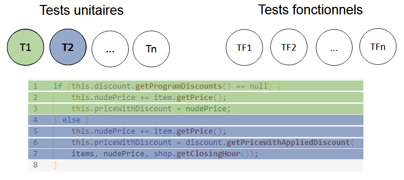

*Figure 1 : Lien entre les tests et les lignes de code couvertes*

Dans la figure 1, on voit que l’on a un ensemble de tests unitaires et de tests fonctionnels. Les tests unitaires T1 et T2 couvrent respectivement les lignes 1 à 3 et 4 à 7. 

##### Étape 2

A la fin de tous les tests, on transforme les informations récupérées en 2 matrices, l’une pour les TU et l’autre pour les TF. Ces matrices regroupent la correspondance des tests aux lignes couvertes (fig. 2). 

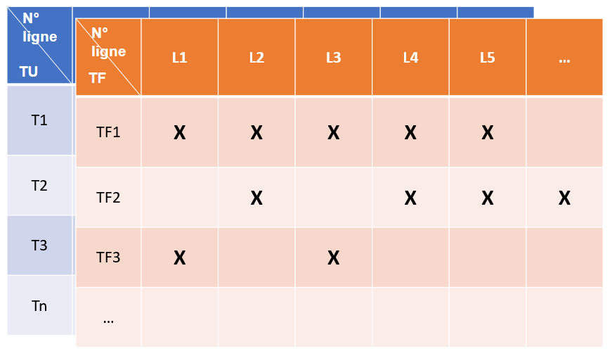

*Figure 2 : Exemple de matrices de couverture de lignes obtenues à la fin du lancement de tous les tests unitaires et fonctionnels*

##### Étape 3

On transforme ensuite ces 2 matrices en 2 ensembles :  

* Lignes couvertes par les TU. 

* Lignes couvertes par les TF.  

La taille des ensembles dépend du nombre de lignes couvertes. Dans ces ensembles, si plusieurs tests passent par une même ligne, cela augmentera également la taille de l’ensemble.  

La figure 3 représente la transformation d’une matrice en un ensemble visualisable de lignes couvertes. La figure 4 est la représentation d’ensembles que l’on attend.

*Figure 3 : Transformation d'une matrice en un ensemble de lignes couvertes*

*Figure 4 : Exemple de deux ensembles de lignes couvertes par TU et TF*

##### Étape 4

Après avoir construit les 2 ensembles, on cherche à trouver leur intersection. Ainsi on pourra conclure si les TU et TF testent les mêmes lignes. 
On s’attend à l’un des résultats de la figure 5 (avec la taille des ensembles et des intersections pouvant varier). 

*Figure 5 : Résultats possibles pour la question 1*

Pour valider l’hypothèse, on s’attend à deux ensembles globaux (fig.5) dont une majorité est commune aux deux.  

### B. Il n’y a aucune corrélation entre le nombre de tests unitaires appelant une méthode et le nombre de tests fonctionnels appelant cette même méthode

Pour chaque projet : 

##### Étape 1

On lance les tests un par un en produisant un rapport JaCoCo à chaque fois. Après la production d’un rapport JaCoCo, on extrait les données utiles avec notre script. 

L’information qui nous intéresse dans le rapport JaCoCo est toujours l’appel des lignes par les tests unitaires et fonctionnels Mais cette fois, il faut que l’on associe nous-même chaque ligne couverte à sa méthode.  

On extrait et calcule ensuite cette information pour chaque test lancé. 

*Figure 6 : Représentation de la couverture de lignes d'un test pour deux méthodes*

Sur la figure 6, on voit que le test passe par la méthode 1 car il couvre des lignes de la méthode 1.

##### Étape 2

A la fin de tous les tests, on transforme les informations récupérées en 2 matrices, une pour les TU et l’autre pour les TF, qui regroupent la correspondance des tests aux méthodes couvertes (fig. 7). 

*Figure 7 : Exemple de matrices de couverture de méthodes obtenues à la fin du lancement de tous les tests unitaires et fonctionnels*

##### Étape 3

On mutualise ces 2 matrices en 1 seule (fig. 8).

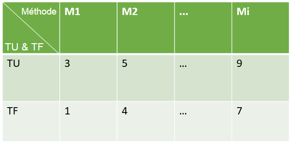

*Figure 8 : Fusion des deux matrices*

##### Étape 4

En utilisant les données de la matrice en figure 7, on trace des graphique (fig. 9, 10).

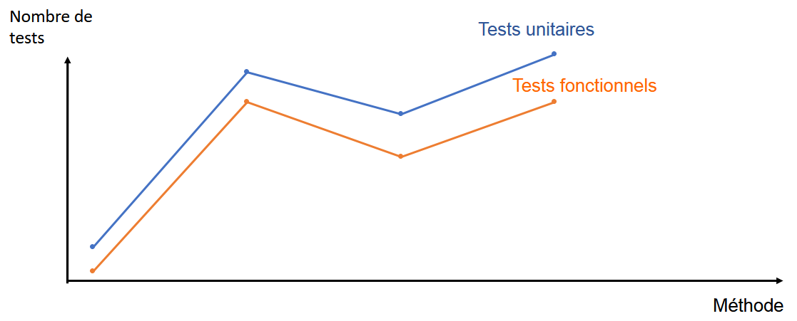

*Figure 9 : Exemple de graphique possible*

La figure 9 contient 2 courbes indiquant le nombre de tests, une pour les TU et l’autre pour les TF, en fonction de la méthode qu’ils testent en abscisse. 
Si les 2 courbes suivent la même évolution, alors on peut en conclure que le nombre de TU et le nombre de TF sont corrélés. 

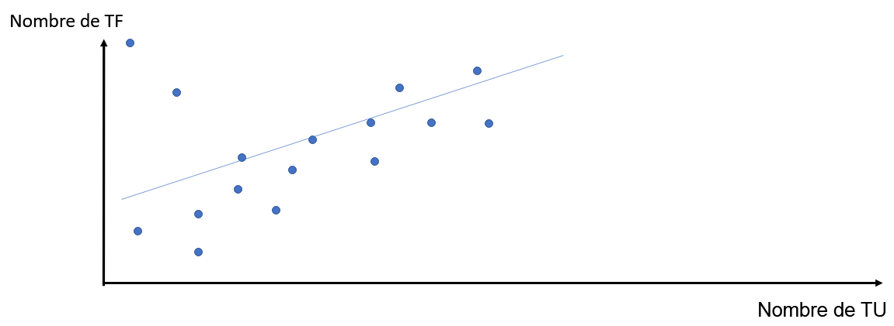

*Figure 10 : Graphique possible du nombre de TF en fonction du nombre de TF par méthode*

Un autre graphique possible est un nuage de points. La figure 10 est un nuage de points où chaque point correspond à une méthode testée. 
La coordonnée x de chaque point est le nombre de TU qui testent la méthode représentée par ce point, et la coordonnée y est le nombre de TF qui testent cette méthode. 
En traçant une courbe de tendance linéaire sur ce nuage de points, on peut voir s’il y une corrélation entre le nombre de TF et le nombre de TU par méthode. 

Si le nuage de points obtenu est trop épars, notre hypothèse sera validée. 

Ce graphique peut être obtenu pour un seul projet mais aussi pour tous les projets en cumulant les points obtenus pour chaque projet. 

### C. Plus une fonctionnalité est complexe, plus il y a de tests unitaires liés à cette fonctionnalité 

Pour chaque projet : 

##### Étape 1

On identifie la complexité de chaque fonctionnalité (fonctionnalité = scénario Cucumber). 

*Figure 11 : Exemple de complexités de fonctionnalités*

Sur la figure 11, la complexité est liée au nombre de lignes du test Cucumber. Cette définition est très limitée, mais a l’avantage de permettre un calcul de complexité très simple. 
La définition pourra, une fois des résultats obtenus et un script terminé, être changée et précisée. On pourrait par exemple considérer que plus un scénario appelle de lignes de codes, plus il est complexe. 

##### Étape 2

Pour chaque fonctionnalité (donc pour chaque scénario Cucumber ou TF), on identifie les méthodes testées (suivant la démarche de la partie B). 

##### Étape 3

Pour chaque TU, on identifie les méthodes testées (suivant la démarche de la partie B). 

##### Étape 4

On déduit ensuite les tests unitaires liés à une fonctionnalité en regardant pour chaque test quelles méthodes sont communes à chaque test fonctionnel. 

*Figure 12 : Exemple de matrices de couverture de méthodes par un test fonctionnel et par tous les tests unitaires*

Sur la figure 12, on voit que la fonctionnalité de TF1 est liée aux tests unitaires T1 et Tn puisque T1 et Tn passent par les méthodes M1 et Mn (les mêmes que pour TF1). 

##### Étape 5 

En utilisant les données obtenues, on trace un graphique (fig. 13) : 

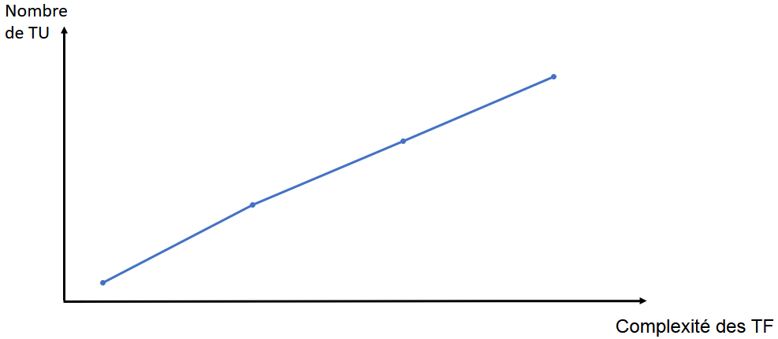

*Figure 13 : Graphique possible du nombre de méthodes couvertes par les TU en fonction de la complexité de la fonctionnalité à laquelle ils sont liés*

Ce graphique peut être obtenu sur pour seul projet mais aussi pour tous les projets testés : 

* en mettant tous les tests fonctionnels sur l’axe des x afin d’obtenir un graphique très étiré sur l’horizontale, 

* ou en créant un graphique pour chaque projet puis en faisant la moyenne du nombre de méthodes couvertes par les TU pour chaque test fonctionnel ayant la même complexité, et produire un graphique moyen, plus petit. 

Encore une fois, le graphique en figure 13 est une simplification grossière. C’est un nuage de points que l’on obtiendra. Nous tracerons la tendance qui se dégage de ce nuage de points. 
Si la courbe est croissante, nous pourrons dans une certaine mesure2 valider notre hypothèse. 

## V. Analyse des résultats et conclusion

Nous avons passé beaucoup de temps à réaliser les scripts de parsing de projets car aucun outil existant ne nous permettait d’avoir les résultats souhaités. Nous avons donc écrit from scratch des scripts NodeJS 
(cf. partie VI.2) qui nous permettent d’obtenir les fichiers d’output nécessaires à la réalisation d’une visualisation de données.  

D’autre part, au vu du temps que nous prenaient la phase de développement des outils d’analyse de projets, nous avons décidé de ne pas réaliser les scripts liant les tests unitaires aux tests fonctionnels. 
Nous n’avons donc pas produit de résultat analysable concernant la question 3.  

### Résultats et analyse

##### Résultats de la démarche pour l’hypothèse 1

*Figure 14: Diagramme de Venn représentant les lignes couvertes par les tests fonctionnels et les tests unitaires pour l’ensemble des projets*

Sur la figure 14 on retrouve le diagramme de Venn cumulatif de tous les projets. Lors de la construction de ce diagramme, les numéros de lignes ont été préfixés par le nom de fichier et 
le nom de projet auquel elles appartiennent pour ne pas les confondre. 

On remarque que la majorité des lignes sont couvertes par les tests unitaires et les tests fonctionnels. On retrouve tout de même des lignes couvertes seulement par l’un ou par l’autre. 

On remarque que certaines méthodes ne sont couvertes que fonctionnellement, ceci est surement dû au fait que les étudiants n’ont pas eu le temps de faire les tests unitaires sur tous les morceaux 
du projet et donc certains morceaux ne sont pas testés unitairement. 

On peut en conclure que notre hypothèse est validée, les TU et les TF ne sont pas disjoints. Ils testent effectivement les mêmes endroits en majorité. Mais certains endroits du code semblent réservés. 

##### Résultats de la démarche pour l’hypothèse 2

Nous avons généré un certain nombre de graphiques pour répondre à cette hypothèse. Ces graphiques représentant pour chaque méthode du code la courbe du nombre de tests unitaires (en rouge) 
et la courbe du nombre de tests fonctionnels (en bleu). L’ensemble des graphiques est disponible [ici](../assets/BehaviorOfBDD/output). 

Premièrement on remarque que les tests fonctionnels appellent plus de fois le code en général que les tests unitaires, cela est dû au fait que les consignes des projets sont orientées 
vers les tests fonctionnels mais également qu’ils sont orientés BDD, ce qui met en avant les tests fonctionnels. On peut effectivement remarquer dans la figure 15 que la courbe 
bleue est dans la majorité des cas au-dessus de la courbe rouge. 

*Figure 15 : Exemple de diagramme du nombre de tests unitaires et fonctionnels pour chaque méthode*

On retrouve des plateaux comme par exemple le graphique suivant (fig.16) où l’on remarque que beaucoup de points sont alignés. Ces points sont surement des sous méthodes appelées 
dans une méthode parente. Ainsi si la méthode parente est appelée x fois alors toutes ces méthodes seront appelées x fois, ce qui génère des plateaux à en ordonné dans le graphique. 

*Figure 16 : Exemple de diagramme du nombre de tests unitaires et fonctionnels pour chaque méthode*

Enfin on remarque également que dans la majorité des cas les courbes évoluent ensemble, c’est à dire que lorsque les valeurs de la courbe bleu augmentent, les valeurs de celle 
de la rouge aussi. Pour la diminution il s’agit de la même chose. On voit donc une corrélation dans la plupart des cas entre le nombre d’appels. 

*Figure 17 : Exemple de diagramme du nombre de tests unitaires et fonctionnels pour chaque méthode*

On retrouve donc dans l’analyse des graphiques une prédominance des tests fonctionnels. On retrouve également une corrélation entre les appels des méthodes par les tests unitaires et par les tests fonctionnels. 
Cette analyse a une limite, il faut suivre les deux courbes pour voir cette évolution commune. Et il est assez fastidieux de comparer pour chaque méthode les deux points de TF et TU. Pour pallier cette limite 
nous pouvons tenter de créer d’autres graphiques.

Après avoir créé les données en brut, on peut retraiter ces mêmes données pour faire d’autres graphiques comme en figures 18 et 19 :

*Figure 18: Dérivée du nombre de tests unitaires et fonctionnels*

*Figure 19 : Ratio du nombre de tests fonctionnels sur le nombre de tests unitaires*

Tout d’abord, le graphique des ratios permet de mettre en évidence la corrélation entre les tests. Un ratio toujours supérieur à 1 ou toujours inférieur à 1, démontre que plus 
il y a de tests unitaires plus il y a de tests fonctionnels. Si le ratio alterne entre des valeurs inférieures à 1 et supérieures à 1 alors il n’y a aucune corrélation à en tirer. 

Ensuite nous avons le graphique de la dérivée, comme on peut le voir dans le graphique généré, nous avons une courbe d’évolution en fonction des méthodes, si on applique une 
dérivée de ces valeurs alors on peut déterminer une corrélation entre l’évolution des courbes. Si le signe de la dérivée est identique entre les tests fonctionnels et unitaires 
alors leur évolution est similaire, plus il y a des un plus il y a des autres. Dans le cas contraire, on peut conclure qu’il n’y a aucune corrélation. 

Ici dans cet exemple, on voit que les dérivées des deux courbes sont dans un grand nombre de cas du même signe et le ratio souvent autour de 2, on pourrait donc conclure que pour ce 
projet, il y a corrélation entre le nombre de tests unitaires et le nombre de tests fonctionnels. Cependant il s’agit de graphiques sur un seul projet, pas d’un graphique global, la conclusion n’est donc pas globale. 

Nous venons de faire des conclusions temporaires sur des projets isolés. Mais nous ne pouvons pas encore généraliser. Il faudrait trouver une visualisation satisfaisante pour 
tous les projets. Nous avons donc déterminé le graphique ci-après qui récapitule les résultats pour tous les projets pour voir la tendance globale. 

Voici le diagramme global qu’on obtient (fig. 20) : 

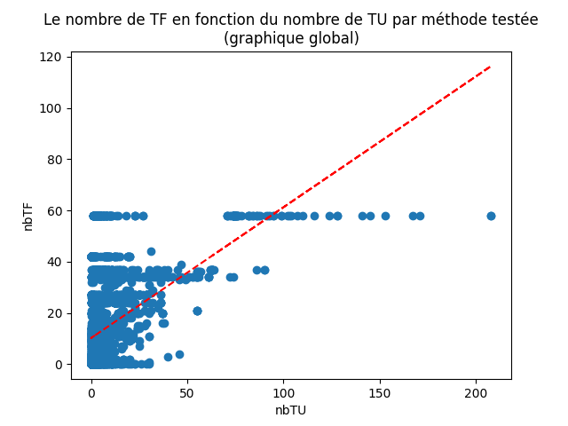

*Figure 20: nuage de points cumulés de tous les projets représentant le nombre de TF en fonction du nombre de TU par méthode testée*

Le graphique global obtenu (qui cumule les résultats de tous les projets) est un nuage de points où chaque point correspond à une méthode testée. La coordonnée x de chaque point est le nombre de TU qui testent la méthode représentée par ce point, et la coordonnée y est le nombre de TF qui testent cette méthode. 

La courbe de tendance linéaire (en rouge) de ce nuage de points est croissante, mais les points sont trop dispersés. 

On peut en conclure que notre hypothèse était vraie, le nombre de TF ne dépend pas du nombre de TU par méthode. 

Si les points étaient concentrés le long de la courbe de tendance, on aurait pu conclure l’inverse. 

Dans certains projets c’est presque le cas, par exemple, dans conception19-20_big_brain (fig. 21) : 

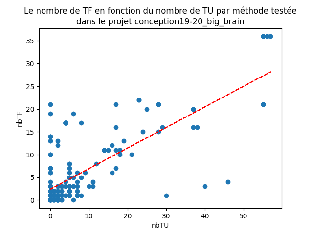

*Figure 21 : nuage de points représentant le nombre de TF en fonction du nombre de TU par méthode pour un projet*

Mais si on revient au graphique global, on voit que ce n’est pas vrai pour tous les projets.

### Limites des résultats 

##### Limites de nos scripts

Une limite évidente vis-à-vis de nos résultats provient de la manière dont nous avons réalisé nos scripts d’analyse. Ils ont été faits from scratch en NodeJS et ne sont pas testés. 

Nous n’avons donc aucun moyen de garantir la fiabilité de nos résultats, ils sont donc à prendre avec beaucoup de précautions. Les premières améliorations à apporter aux scripts seraient 
donc de tester leurs résultats afin de s’assurer de leur fiabilité et afin de pouvoir faire une conclusion fiable. 

Nos scripts sont pour l’instant à portée limitée. En effet, il faut que les projets que l’on analyse aient le même format (le format par défaut de Maven).  Si le script rencontre un format 
anormal de projet ou de fichier (fichier vide par exemple), il crash.  

Enfin, notons une limite importante : nos scripts marchent bien et donnent des résultats cohérents pour les projets 2019/2020. Mais les projets 2020/2021 donnent des résultats moins cohérents. 
Le nombre de tests fonctionnels couvrant chaque méthode semble fixe. Nous n’avons pas encore trouvé la cause de cette incohérence qui est peut-être due à une différence de version Cucumber ou 
Java entre les projets 2019 et 2020. C’est pour cela que dans la partie précédente nous montrons deux graphiques différents. 

##### Set de projets 

D’autre part, le set de projets que nous analysons est constitué de projets étudiants et n’est donc pas significatif par rapport aux valeurs réelles que l’on obtiendrait sur un 
set de projets plus épars venant de milieux différents. Comme il est très difficile d’obtenir des projets open source comportant des tests fonctionnels avec des tests unitaires 
qui soient analysables de la même manière, nous avions pris le parti de n’analyser que des projets Cucumber Java de projets étudiants. Les résultats sont donc faciles à analyser, 
avec une structure quasiment identique mais il faut également prendre en compte que tous les projets analysés respectaient des contraintes imposées par un sujet. Ce sujet imposait 
l’utilisation de tests fonctionnels, il est donc normal que l’on en retrouve en grande quantité. 

Il est donc important de ne pas considérer les résultats que nous analysons comme des vérités générales. Ils ne concernent qu’une partie très restreinte de l’ensemble des projets BDD. 

Enfin, on remarque une différence dans les résultats de la partie 2 pour les projets de conception 2019-2020 et ceux de 2020-2021. 

Dans le cas des projets de conception logicielle 2019-2020 les points sur le graphique sont dispersés aléatoirement (fig. 22) : 

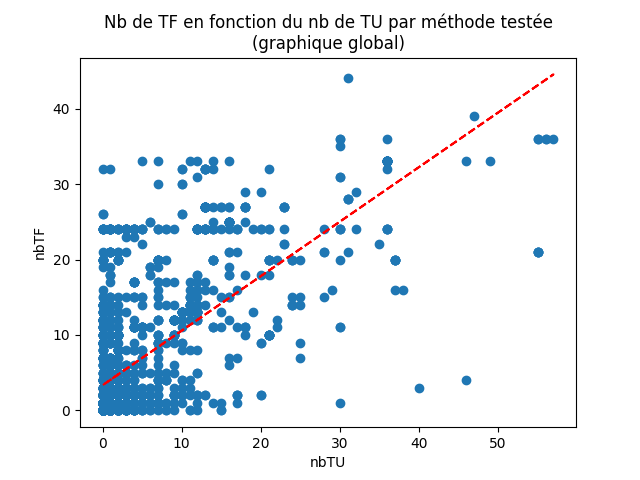

*Figure 22 : Graphique global obtenu pour les projets de Conception Logicielle 2019-2020*

Tandis que pour les projets 2020-2021 ce n’est pas le cas, on observe la dispersion en lignes horizontales (fig. 23) : 

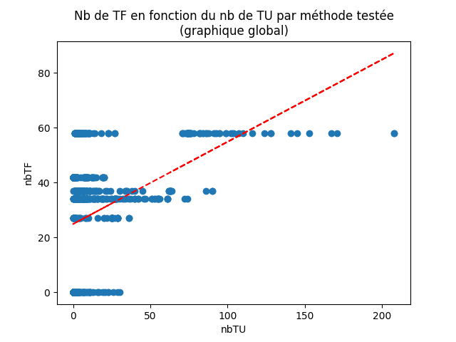

*Figure 23 : Graphique global obtenu pour les projets de Conception Logicielle 2020-2021*

L’analyse de chacun de ces graphiques nous mène toujours à la même conclusion que l’analyse du graphique global. On voit cependant qu’il y avait un risque non négligeable de biais dû 
à nos scripts qui ne semblent pas marcher correctement sur un set de projets. La figure 21 est donc plus représentative de la tendance globale. 

## VI. Outils

### JaCoCo 

L’outil JaCoCo permet de générer un rapport détaillé des lignes couvertes par le lancement des tests avec Maven. Ainsi, lancer la commande `mvn test` génère plusieurs fichiers de 
reporting (html pour la visualisation, CSV ou encore xml). Le fichier qui nous intéresse dans le cas de la récupération automatique des lignes couvertes par les tests est le fichier XML. 
Ce dernier permet en effet d’avoir, pour chaque fichier source du projet, des informations sur les méthodes ainsi que sur les lignes couvertes. 

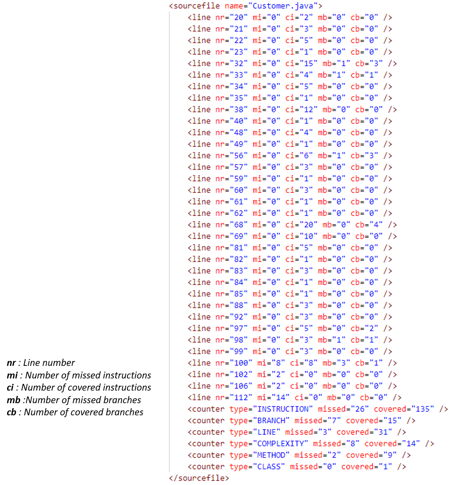

*Figure 24 : Echantillon du fichier XML généré par JaCoCo*

Sur la capture d’écran (fig. 24), on peut voir une représentation de l’information XML générée par JaCoCo pour le fichier Customer.java.  

En lançant les tests unitaires un par un puis les tests fonctionnels un par un, il nous est possible d’obtenir un tel fichier pour chacun des tests, et donc d’obtenir les lignes couvertes par chacun des tests. 

Les figures y et z correspondent à la représentation visuelle correspondant à la figure x et donnée par le fichier html généré par JaCoCo.  

*Figure 25 : Échantillon 1 du fichier html généré par JaCoCo*

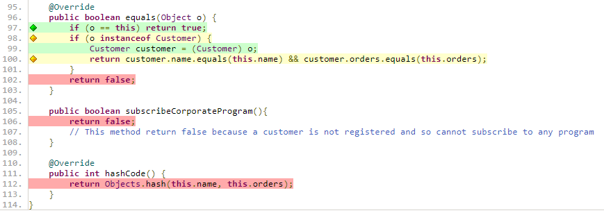

*Figure 26 : Échantillon 2 du fichier html généré par JaCoCo*

Les lignes surlignées en vert sont les lignes dont tous les cas possibles ont été couverts par les tests lancés. Les lignes en orange sont couvertes par les tests lancés, mais tous les cas ne sont pas couverts. Enfin, les lignes rouges sont les lignes non couvertes. 

Les lignes qui nous intéressent sont les lignes par lesquels les tests passent au moins une fois, soit les lignes orange et vertes. 

Il s’agit maintenant de trouver, à partir des attributs mi (nombre d’instructions ratées par le test), ci (nombre d’instructions couvertes par le test), mb (le nombre de cas possibles ratés par le test) et cb (le nombre de cas possible couverts par le test) du fichier XML, la condition à partir de laquelle un test est bien passé par une ligne. 

Les attributs qui nous intéressent dans notre cas sont nr (le numéro de la ligne), mi (nombre d’instructions ratées par les tests), mb (le nombre de cas possibles ratés par les tests) et cb (le nombre de cas possible couverts par les tests).  

Nous avons, en comparant les valeurs des attributs et les couleurs des lignes html générés par JaCoCo, conjecturé cette condition :  

Une ligne est couverte si cb > 0 || (mi == 0 && mb == 0). 

Les attributs qui nous intéressent pour générer la matrice sont donc mi, mb, cb et bien-entendu nr (le numéro de la ligne). 

A partir de la matrice, il suffit de faire des calculs intermédiaires pour obtenir les résultats désirés et explicités en partie IV et VI.D.

### Node JS avec ChartJS 

Pour la réalisation du script nous avons choisi NodeJS pour plusieurs raisons : 

* Nous souhaitons traiter des données au format JSON (juste après les avoir récupérées en XML) 

* Avoir un grand catalogue d’outils pour faciliter le développement, cela nous a permis par exemple d’avoir des outils pour lister les fichiers 
java d’un projet très simplement, de récupérer la liste des méthodes et la liste des tests dans les fichiers 

* Avoir un projet facilement reproductible sur n’importe quel système, les outils et dépendances sont cross-plateforme. 

Pour ces raisons NodeJS nous semble être un choix pertinent pour analyser les données et les générer. 

Enfin pour une partie des graphiques nous avons choisi d’utiliser ChartJS qui permet facilement avec un plugin supplémentaire de générer le PNG d’un graphique. 
Cette librairie est bien documentée pour ce que l’on souhaitait générer. 

### MatPlotLib 

Pour générer nos graphiques (diagramme de Venn et nuage de points), nous avons utilisé les librairies matplotlib et matplotlib_venn de Python. Ces librairies sont destinées à la visualisation des 
données, sont largement utilisées à cette fin (par exemple, dans beaucoup de projets d’analyse de données sur [kaggle](https://www.kaggle.com/)) et sont faciles à prendre en main. 

### Fonctionnement des scripts 

1. Le premier script va lister les tests unitaires du projet. Une fois les tests unitaires listés il va lancer pour chaque test une commande maven test afin de générer une sortie JaCoCo (xml) pour ce test uniquement. Chaque sortie JaCoCo est analysée et une matrice est créé : la matrice des lignes couvertes par chaque test (figure 2), cette matrice va être transformé en json : matrix-tu.json  

2. Ensuite les extensions des fichiers de tests unitaires sont changées pour que le prochain script de test les ignore. 

3. Ce prochain script va ensuite faire la liste des tests fonctionnels (liste des scénarios Cucumber). Cette étape est la même que l’étape 1 si ce n’est que cette fois-ci ce sont des tests fonctionnels et donc un json nommé : matrix-tf.json (figure 2) 

4. Les extensions des fichiers de tests unitaires sont remises à la normal. 

5. La Liste des méthodes de tous les fichiers (hors tests) est faite et mise dans un json : method-list.json 

6. La matrice de l’étape 2 est récupérée et comparée à la liste des méthodes pour obtenir les méthodes appelées par les tests unitaires, le résultat est une matrice exportée en tant que matrix-methods-tu.json. La même chose est réalisée pour les tests fonctionnelles. On obtient une matrice suivant le modèle de la figure 7. 

7. Enfin on récupère les 2 matrices générées en étape 6 et on somme pour chaque matrice les méthodes appelés pour avoir pour chaque méthode le nombre de fois qu’elle est appelée par les tests unitaires et fonctionnels. Enfin on merge les 2 matrices pour ne faire qu’une matrice (figure 7).

##### Note

Pour l’étape 1 nous lançons les tests unitaires un par un à l’aide de la commande :  

`mvn -Dmaven.clean.failOnError=false -Dtest=<packageTest.classTest.testName> clean test` 

Pour lancer les scénarios fonctionnels un par un : 

`mvn -Dmaven.clean.failOnError=false -Dcucumber.options="<nom-du-fichier:ligne-du-scenario>" clean test`

### Utilisation des scripts

Pour reproduire notre démarche avec les scripts que l’on a réalisé, nous vous invitons à lire le [readme de notre projet](../assets/BehaviorOfBDD/README.md). 

Pour générer les diagrammes à partir les résultats des scripts précédents, il suffit d’exécuter le fichier “scripts.py” du répertoire “DataVizScripts” 
(avec la commande `python scripts.py` ou depuis IDLE). Les graphiques seront générés dans le même répertoire “output” que tous les autres outputs. 

## VII. Conclusion

En définitive, bien que nous ayons été fortement limités par le temps pris à développer nos scripts et par leur fiabilité, nous avons pu dégager une réponse temporaire à nos 
deux premières hypothèses. Nous pouvons valider la première ainsi que la deuxième. Nous parlons ici de résultat temporaire parce que les limites de notre démarche sont nombreuses 
et nos résultats ne sont significatifs que pour notre set de données CookieFactory 2019-2020. Quant à la troisième hypothèse, nous ne pouvons rien en dire puisqu’il ne nous a pas été possible de la tester expérimentalement.  

La prochaine étape pour affiner nos résultats est de tester nos scripts pour le rendre plus fiable sur un plus grand set de projets et d’ajouter l’analyse des données manquantes pour répondre à la troisième question.

## VIII. Réferences

1. [Article modèle pour la démarche expérimentale](https://hal.inria.fr/hal-01344842/file/Test_Case_Selection_in_Industry-An_Analysis_of_Issues_related_to_Static_Approaches.pdf)
2. [Documentation JaCoCo](https://www.jacoco.org/jacoco/trunk/doc/)
3. [Notre code](../assets/BehaviorOfBDD)
