## Authors

Nous sommes quatre étudiants en 5ème année de diplôme d'ingénieur à Polytech Nice-Sophia, spécialisés en architecture logicielle :  

* Ilyas EL BANI &lt;ilyas.el-bani@etu.univ-cotedazur.fr&gt;
* Alexia GIRARD &lt;alexia.girard@etu.univ-cotedazur.fr&gt;
* Côme DEMOLLIERE &lt;come.demolliere@etu.univ-cotedazur.fr&gt;
* Meriam Zekri &lt;meriam.zekri@etu.univ-cotedazur.fr&gt;

## **I. Mise en contexte**
La question du sujet proposé au départ est : [ “Les tickets permettent-ils une meilleure compréhension de l’architecture d’un système ?](https://docs.google.com/document/d/1lY0OArbvPvbuHBK1dCuNzkyhSVU45M_paZ1jC5hP0HM/edit#heading=h.nciph9dbajbi)”. 

Pour commencer à réfléchir sur cette thématique, nous nous sommes interrogés sur notre utilisation des tickets au quotidien, en tant qu’étudiant mais également en tant qu’apprenti en entreprise puisque nous sommes tous les quatre en alternance.

Après réflexion, nous nous sommes rendus compte que nos principales actions avec les tickets sont : la création d’un ticket lors de la rencontre d’un bug, la création d’un ticket pour l’implémentation d’une nouvelle fonctionnalité mais aussi la consultation de tickets existants lors de l’investigation d’un bug.

Nous avons choisi de nous concentrer sur le dernier point : l’investigation d’un bug à travers les tickets. En tant que développeur, nous passons une grande partie de notre temps à résoudre des bugs mais surtout à investiguer pour trouver la source du problème et comment le résoudre.

Nous souhaitons donc nous demander si le ticketing peut être un bon moyen pour remonter au code source d’un bug, tout en ayant un gain de temps.

## **II. Problématiques**
La question générale à laquelle nous souhaitons répondre est la suivante :

**“En quoi le ticketing peut être utile lors d’une investigation d’un bug?”**

Par investigation, nous considérons la détection du bug à sa résolution, nous nous intéressons donc à tout le processus de recherche de la source du problème, c’est-à-dire du code source impacté jusqu’à la correction du bug.

A partir de cette question, nous avons décomposé nos recherches sous forme de quatre sous questions.

**Comment retrouver des tickets qui peuvent apporter des infos pour l’investigation d’un bug ?** 

Lors de l’investigation d’un bug, un des premiers réflexes est d’aller chercher des informations sur l’outil de ticketing utilisé.

Un développeur peut rechercher des informations sur des tickets existants sur l’outil de ticketing utilisé afin de l’aider dans la résolution du problème. Ces informations peuvent être retrouvées dans un ticket de bug similaire mais aussi dans un ticket correspondant à la fonctionnalité lié au bug. 

Nous souhaitons nous demander comment retrouver ces tickets sources de renseignements de manière rapide et efficace, comment cibler correctement les tickets intéressants.

**Quelles informations peuvent être retrouvées et peuvent être utiles dans un ticket ?** 

Notre seconde question concerne les renseignements que l’on peut retrouver dans un ticket. 

Une fois que l’on a trouvé un ticket pouvant être lié au problème, plusieurs informations sont disponibles. Le titre, la description, la personne ayant rédigé ce ticket, la personne assignée ou encore la criticalité du ticket sont des éléments que nous pensons utiles pour le développeur lors de l’investigation d’un bug.

Il est important de se demander quelles sont les informations les plus utiles parmi celles disponibles car il peut y en avoir une grande quantité.
Ces renseignements sont primordiaux afin d’effectuer les trois étapes d’une résolution de bug qui sont : l’identification de l’origine du problème, la reproduction du problème, et la correction. 

**Une fois qu’un ticket en rapport avec le bug a été retrouvé, comment remonter au code source ?** 

Lorsqu’un ticket correspondant à notre problème a été trouvé, celui-ci nous apporte des informations mais il est intéressant d’exploiter à présent ces renseignements.

Nous souhaitons déterminer comment remonter au code source impacté par ce bug à partir des informations récupérées et quelles sont les informations les plus pertinentes pour cela.

**Qu’est-ce qu’un ticket de bug idéal ?**

Pour finir nous souhaitons nous poser cette question car pour qu’un ticket et ses informations soient exploitables lors d’une recherche il faut que ce ticket soit correctement créé. 

Nous souhaitons trouver de quelle manière les projets open-source souhaitent par exemple rédiger les tickets de bug. Ces informations vont nous permettre de cibler plus facilement nos expérimentations pour les autres sous-questions.
## **III. Hypothèses et expériences**
### **1. Comment retrouver un ticket qui peut apporter des infos pour l’investigation d’un bug ?**

**Hypothèse n°1**

Notre première intuition est qu’il est intéressant de rechercher un ticket pouvant nous aider directement par mot clé en recherchant ce mot dans le titre mais aussi dans la description.

**Expérimentation**

Pour vérifier cette hypothèse nous avons expérimenté ceci à la main grâce à l’outil de ticketing GitHub et sa barre de recherche. Cette expérimentation sera faite manuelle car il est difficile d’automatiser cette recherche, chaque ticket récupéré doit être analysé par un humain afin d’identifier si il est proche de notre problème et nous aider dans notre investigation.

Nous avons choisi le projet Angular sur Git pour plusieurs raisons. Tout d’abord, le projet est suffisamment conséquent pour avoir matière à travailler. De plus, l’outil de ticketing Git offre une API facile d’utilisation qui nous permettra, dans un second temps, d’automatiser nos recherches. 

Voici le lien du repo : <https://github.com/angular/angular/issues>. 

Nous allons donc prendre un ticket de bug récent, toujours ouvert, et rechercher un mot clé (présent dans le titre ou la description du ticket) dans les tickets ouverts et fermés du projet. 

**Hypothèse n°2**

Notre deuxième intuition est que filtrer par le statut fermé d’un ticket peut nous permettre de retrouver des tickets déjà résolus et qui contiendront beaucoup plus d’informations pour nous aider.

**Expérimentation**

Pour vérifier cette hypothèse nous allons lancer notre algorithme sur le projet Angular avec le mot clé “bug report” qui signifie qu’un bug est recensé dans le ticket en question.

Notre algorithme va donc en extraire tous les tickets de bug recensés dans Angular et va séparer les tickets ouverts et ceux fermés. L’idée va être de comparer le nombre moyen de commits, de personnes assignées au ticket ainsi que le nombre de commentaires. Si les données sont plus élevées pour les tickets fermés cela signifiera que l’on a plus de chance d’obtenir plus d’informations pertinentes dans les tickets fermés de bug.

**Hypothèse n°3**

Notre troisième hypothèse est de faire une recherche sur les dates des tickets. Nous pensons qu’il peut être intéressant de retrouver les tickets qui ont été créés ou mis à jour avant l’apparition du bug pour déterminer s’ils en sont la cause, en particulier des tickets sur une nouvelle fonctionnalité.

**Expérimentation**

Pour vérifier cette hypothèse, nous allons également effectuer cette expérience manuellement sur le projet angular et voir quels résultats nous pouvons obtenir.

### **2. Quelles informations peuvent être retrouvées et peuvent être utiles dans un ticket ?**

**Hypothèse n°1**

Notre intuition est qu’un ticket de bug renferme des informations qui peuvent être utiles pour un développeur lors de l’investigation d’un bug. Nous pensons que les informations telles que le titre, la description et le statut de l’issue sont des informations importantes dans un ticket de bug.

**Expérimentation**

Pour répondre à cette hypothèse, nous avons souhaité mettre en place un sondage que nous avons diffusé sur les réseaux sociaux en ciblant des développeurs. Nous leur avons donc posé la question : “Quelles informations contenues dans un ticket de bug sont le plus utiles pour vous ?”. Nous avons également permis aux développeurs de pouvoir détailler leur réponse dans une question ouverte.

**Hypothèse n°2**

Notre seconde intuition est qu’un ticket concernant la fonctionnalité impactée peut être intéressant et contenir des informations utiles pour la résolution d’un bug. Nous pensons à nouveau que le titre ainsi que la description sont des informations importantes. Nous pensons également que la référence vers d’autres tickets ou encore les développeurs assignés à cette tâche sont des éléments essentiels dans un ticket.

**Expérimentation**

Pour répondre à cette hypothèse, nous avons posé une seconde question dans notre sondage qui est “Quelles informations d’un ticket de tâche relié à la fonctionnalité impactée sont utiles pour vous lorsque vous êtes en train de résoudre un bug ?”.

### **3. Une fois qu’un ticket en rapport avec le bug a été retrouvé, comment remonter au code source ?**

**Hypothèse n°1**

Nous avons l’intuition que le ticketing peut fortement aider à remonter au code source et surtout grâce à toutes les informations qu’un ticket contient. 

**Expérimentation**

Pour vérifier cette hypothèse, nous allons mettre en place un programme de recherche grâce à l’API de GitHub afin de récupérer des tickets de bug et de retrouver dans ces tickets le nombre moyen de personnes assignées, le nombre de commits ou encore le nombre moyen de logs. Nous considérons que si ces données sont élevées, nous pourrons en déduire que le ticketing peut être d’une grande aide pour retrouver le code source lors de la résolution de bug.

**Hypothèse n°2**

Nous avons l’intuition qu’une fois le ticket de bug trouvé, le développeur peut remonter au code source grâce aux informations contenues. Nous pensons notamment qu’une liste de commits relatifs à ce ticket peut vraiment aider un développeur puisqu’un commit pointe directement vers le code source.

**Expérimentation**

Pour valider ou non notre hypothèse, nous avons souhaité poser la question à des développeurs. Nous leur avons demandé à quel point le ticketing les aide à trouver la source d’un bug et nous leur avons laissé le choix de nous donner plus de détails en question ouverte pour découvrir quelles informations leur ont permis de trouver la source du bug.

**Hypothèse n°3**

Il est possible qu’il n’y ait pas de commits reliés à ce ticket, c’est pourquoi nous pensons que contacter les personnes assignées peut permettre au développeur de remonter jusqu’au code source et d’avoir une idée de comment résoudre le bug.

**Expérimentation**

Nous avons posé la question aux développeurs à l’aide de notre sondage. Nous leur avons demandé à quel point les services proposés par le ticketing leur permettent de retrouver la meilleure personne (celle qui a le plus de connaissances sur ce bug) lors d’une investigation.

### **4. Qu’est-ce qu’un ticket de bug idéal ?**

**Hypothèse n°1**

Un ticket de bug idéal peut être très subjectif et est relatif à un projet spécifique. Dans des projets open-source, chaque développeur peut créer un nouveau ticket mais a un template prédéfini à suivre pour résoudre un bug. Notre intuition est qu’il existe des informations plus pertinentes que d’autres à faire figurer dans un ticket.

**Expérimentation**

Nous allons rechercher des projets open-source ayant un template à remplir lors de la création d’un nouveau ticket de bug. Les informations demandées vont nous permettre de faire une liste de renseignements importants. Ceci va nous permettre de pouvoir améliorer notre algorithme de recherche et cibler directement les informations qui semblent intéressantes pour tous dans un ticket de bug.
## **IV. Ressources utilisées**
Lors de la définition du projet, nous nous sommes orientés tout d'abord vers un des outils de ticketing proposés dans le sujet qui est Bugzilla. Nous nous sommes rapidement rendu compte qu’il nous fallait quelque chose de plus basique et nous avons donc souhaité nous orienter vers des outils de ticketing que nous connaissons comme Jira ou encore GitHub. De part nos expérimentations, nous avons besoin que l’outil de ticketing choisi ait une bonne API, nous nous sommes tournés vers celle de GitHub qui après des essais nous a permis de constater qu’elle propose la plupart des requêtes dont nous avons besoin pour notre programme de recherche de tickets.

Toute notre zone de recherche de tickets est donc basée sur l’outil de ticketing Github et plus précisément sur un projet open-source qui nous a semblé intéressant qui est Angular (comme dit précédemment).

||Nombre de tickets ouverts|Nombre de tickets fermés|Nombre de commits (master)|Nombre de contributeurs|
| :- | :- | :- | :- | :- |
|[Angular](https://github.com/angular/angular)|2,444|19,787|20,106|1,345|
|[Elasticsearch](https://github.com/elastic/elasticsearch)|2,696|23,474|57,243|1,584|

Pour nos premières recherches, les fonctionnalités présentes sur l’interface de Github nous ont été utiles puis nous avons créé un script en Javascript qui nous permet de facilement extraire des données grâce à des appels à l’[API de Github](https://docs.github.com/en/rest). Les données récupérées sont extraites dans un fichier Excel (.csv) ce qui va nous permettre de pouvoir réaliser directement des diagrammes.

Un autre aspect de nos recherches est de questionner des développeurs directement pour avoir leur avis sur les outils de ticketing et leur usage lors de l’investigation d’un bug. Nous avons donc réalisé un sondage Google Forms que l’on peut retrouver à l’adresse suivante : <https://forms.gle/jZ85DYSBEnUZ1BfbA> 

Ce sondage a été partagé sur Twitter, sur Facebook ou encore sur Reddit.

Les données du sondage sont extraites dans un fichier Excel ce qui nous permet de réaliser des diagrammes parfois plus poussées que ceux proposés directement par Google Forms lors de la réception de nouvelles réponses. 

Nous nous sommes également intéressés au fichier CONTRIBUTING.md que l’on peut retrouver dans de nombreux projets open-source. Dans ce fichier, on retrouve très souvent la procédure à effectuer lors de la découverte d’un bug et lorsqu’on souhaite créer un nouveau ticket, un template d’un ticket de bug est disponible ce qui permet d’identifier les informations importantes à renseigner.
Nous nous sommes intéressés au projet Angular ainsi qu’au projet Elasticsearch à nouveau, nous avons ajouté également le projet [Electron](https://github.com/electron/electron) afin de s’intéresser à leur manière de décrire un ticket de bug.
## **V. Analyse des résultats**
### **1. Comment retrouver des tickets qui peuvent apporter des infos pour l’investigation d’un bug ?** 

**Hypothèse 1**

Pour répondre à l’hypothèse qui est “la recherche par mot clé nous permet de retrouver des tickets similaires pouvant nous aider”, prenons le ticket cible suivant pour exemple : <https://github.com/angular/angular/issues/38191>

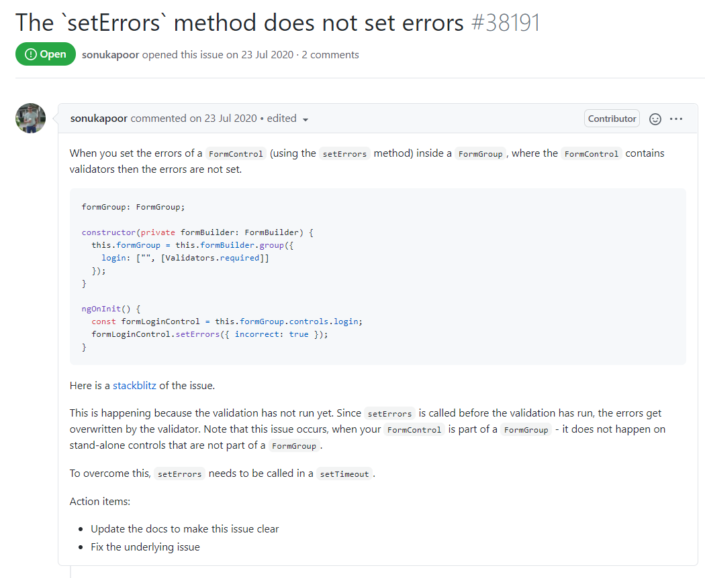

Lorsque l’on recherche le mot clé ‘setErrors’, nous obtenons 20 tickets dont 8 ouverts et 12 fermés : <https://github.com/angular/angular/issues?q=is%3Aissue+setErrors+in%3Atitle%2Cbody+>

Parmi ces tickets, nous en avons trouvé 10 qui pourraient potentiellement apporter des pistes de recherches pour l’investigation. De plus, même les tickets qui peuvent sembler hors sujet peuvent parfois donner des informations utiles, comme le ticket #31963 qui informe le développeur sur le comportement et l’utilisation de la fonction setErrors() :

La recherche manuelle a été satisfaisante (environ 50% de tickets potentiellement utiles à l’investigation). Nous pouvons considérer que notre hypothèse est validée puisqu’avec une recherche par mot-clé, 50% des tickets récupérés peuvent nous aider dans notre investigation.

**Hypothèse 2**

Notre seconde intuition était que les tickets fermés peuvent apporter plus d’informations que des tickets encore ouverts car non résolus. Nous avons utilisé l’algorithme pour répondre à cette question.

Voici les résultats qu’on obtient après avoir lancé notre algorithme sur le projet Angular : 

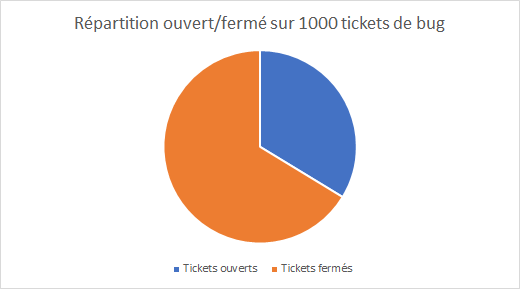

Nous avons extrait 1000 résultats de la recherche ce qui nous donne 391 tickets ouverts et 611 tickets fermés.

||Commits|Commentaires|Personnes assignées|
| :- | :- | :- | :- |
|Tickets ouverts|0,63|0,21|11,5|
|Tickets fermés|1,68|0,17|6,89|

Ces résultats nous permettent de nous rendre compte que les tickets fermés ont une moyenne de commits plus importante que pour les tickets fermés (1,68 contre 0,63). Le nombre de commentaires est assez similaire pour les deux cas, les commentaires représentent une discussion et ne comportent pas toujours des informations apportant une grande valeur au problème.
La moyenne de personnes assignées pour un ticket ouvert est plus important que pour les tickets fermés, ceci peut s’expliquer par le fait qu’un ticket ouvert correspond à un bug toujours pas résolu, ainsi de nouvelles personnes peuvent s’ajouter au fur et à mesure en tant que personne assignée afin d’aider à résoudre le problème.
Notre hypothèse est partiellement vérifiée car les tickets fermés ont plus de commits donc plus d’informations concernant le code modifié mais les tickets fermés n’ont pas plus d’informations concernant les personnes assignées.

**Hypothèse 3**

Pour la recherche par date, l’expérience n’a pas été concluante.

Prenons l’exemple du ticket suivant : https://github.com/angular/angular/issues/38697

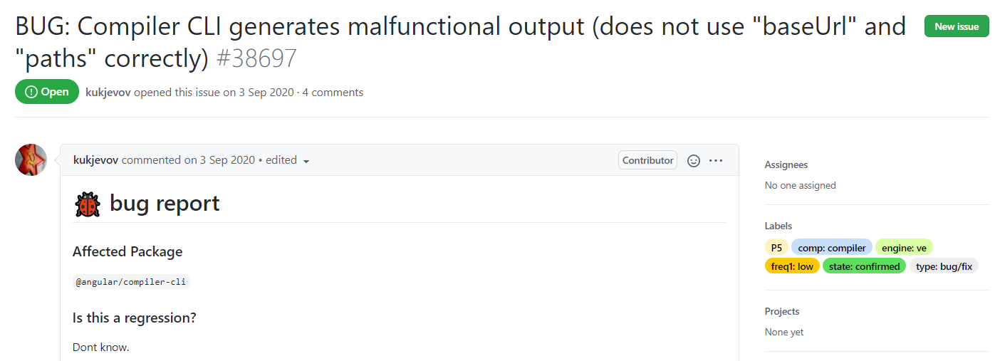

Nous avons ajouté un filtre dans la recherche nous permettant de récupérer les tickets ayant été créés avant la date de création de ce ticket cible : <https://github.com/angular/angular/issues?q=is%3Aissue+created%3A%3C2020-09-04>

Le résultat obtenu contient une grande quantité de tickets sur tout type de sujet. Il est donc difficile de s’y retrouver.

Nous avons ajouté un filtre pour ne récupérer que tickets sur l’implémentation d’une nouvelle feature : <https://github.com/angular/angular/issues?q=is%3Aissue+created%3A%3C2020-09-04+label%3Afeature>

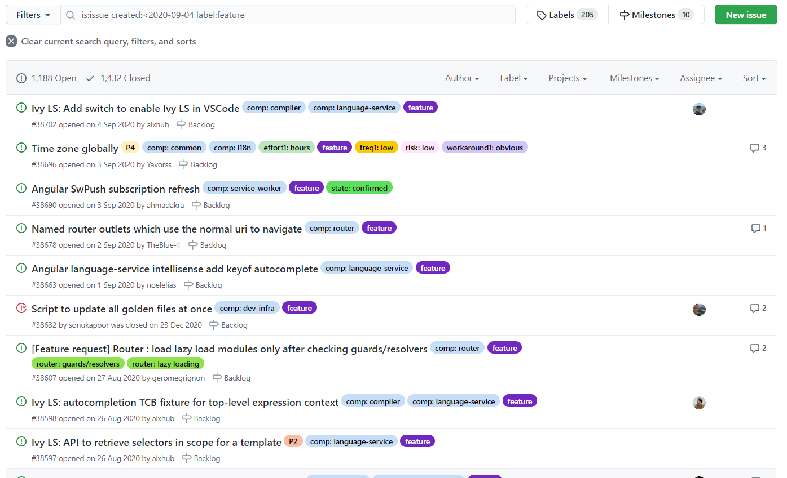

Nous n’avons pas pu retrouver des tickets potentiellement utiles en recherchant par date. Tous les tickets remontés semblent hors sujet, et le nombre d’informations à analyser est trop important.

Après avoir réitéré la recherche sur différents tickets de bug cibles, nous n’avons pas pu identifier de tickets utiles à l’investigation, même en combinant différents filtres comme le label ou un filtre sur les tickets fermés. 

Il est possible que cette recherche puisse être pertinente lorsque l’on a une bonne connaissance du projet et de son implémentation, ce qui n’est pas notre cas avec le projet angular.

### **2. Quelles informations peuvent être retrouvées et peuvent être utiles dans un ticket ?** 

Pour répondre à cette question, nous avons réalisé un sondage auprès de développeurs afin de connaître les informations qui sont les plus utiles pour eux lors de l’investigation de bug.

**Hypothèse 1**

Notre première hypothèse était que dans un ticket de bug retrouvé par un développeur, le titre, la description ainsi que le statut de l’issue sont des informations importantes.

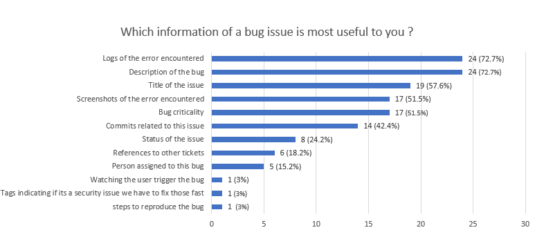

D’après les résultats, en effet la description du bug ainsi que le titre de l’issue sont des informations très utiles. La description semble néanmoins avoir une plus grande importance dans un ticket de bug que le titre puisque 72,7% des sondés ont jugé très utile la description contre 57,6% pour le titre du ticket.
Une information que nous n’avions pas identifiée comme importante en premier lieu sont les logs puisque ce renseignement obtient un résultat de 72,7% comme la description. A la suite, on retrouve ensuite les captures d’écran de l’erreur rencontrée, la criticité d’un bug puis les commits liés à cette issue.

Les sondés avaient la possibilité de nous laisser plus d’informations sur leur réponse. La plupart des sondés explique qu’il est vraiment primordial de retrouver toutes les informations pour reproduire le problème dans le ticket de bug, le développeur a la charge de ce ticket sera forcément beaucoup plus efficace dans la résolution du problème. Dans le cas où il est difficile de reproduire l’erreur, il est très important d’avoir les logs ainsi que des captures d’écran.

Voici quelques remarques de sondés :
“*A big bug should be reproduced. 
In order to do so, the one that encounter the bug must give the context of his/her actions. 
Then the Dev can much more efficiently solve the issue and test the solution. 
Title and description enables the Dev to understand where and when the issue is. 
Log may avoid to the Dev to reproduce the issue him/herself in complicated environment.”*

*“\* Title of the issue is often what you see when searching or planning, a good title is super important 
\* A good description allows for effective resolution of the ticket, ensuring that you actually understand the issue 
\* Logs of the error encountered can often help when something is hard to reproduce, or help inform reproduction steps that might not be accurate 
\* Bug criticality helps understand the impact to the user, and prioritize what should be done and when.”*

Notre hypothèse est partiellement validée puisque les informations que nous jugeons importantes le sont pour les développeurs sondés. Cependant il s’avère que les logs sont très importants et sont aussi importants que la description.

**Hypothèse 2**

Notre seconde hypothèse est portée sur les tickets correspondant à la fonctionnalité impactée par le bug. De la même manière, nous avons posé la question aux sondés. Nous pensions que le titre, la description ainsi que la référence vers d’autres tickets ou vers des développeurs étaient des informations utiles.

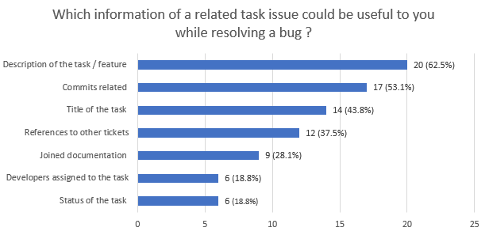

D’après les résultats, la description de la tâche arrive en première position avec 62,5%, les commits reliés ainsi que le titre de l’issue sont des informations importantes pour les sondés. L’information concernant les développeurs assignés à cette tâche est finalement peu utile pour les développeurs puisque seulement 18,8% des sondés la juge utile lors de la résolution d’un bug.
A nouveau, notre hypothèse est vérifiée partiellement puisque la description et les commits sont des informations importantes comme prévu ; le renseignement des développeurs assignés est un peu moins important que notre prévision.

### **3. Une fois qu’un ticket en rapport avec le bug a été retrouvé, comment remonter au code source ?**

**Hypothèse 1**

L’hypothèse est qu’un ticket de bug contient des informations qui permettent de remonter au code source. Plus les informations sont nombreuses, alors plus il est possible de retrouver facilement le code source impacté par le problème. Pour cette hypothèse nous partons du principe qu’il existe 3 manières principales de remonter jusqu’au code source d’un bug à partir d’un ticket. Ces trois manières sont les commits car ils modifient directement le code concerné, les logs car ils contiennent des informations sur le bug rencontré et potentiellement la ligne de code où l’erreur est survenue et enfin les personnes assignées à un ticket peuvent aussi nous aider à remonter au code source car ils peuvent connaître le code en question.

Nous avons recherché 1000 tickets et nous avons récupéré leur nombre de logs, de commits ainsi que les personnes assignées. Ceci nous a permis d’extraire des diagrammes pour chaque donnée.

Voici nos résultats :

||Avec commits|Avec logs|Avec personnes assignées|Avec au moins une information|
| :- | :- | :- | :- | :- |
|% de tickets|23,4|26,55|17,8|55,2|

Parmi les tickets récupérés, on peut remarquer tout de même que plus d’un ¼ des tickets ont des logs. Ces informations sont essentielles pour pouvoir reproduire un bug, l’exploration des logs peut permettre d’identifier le code impacté par le bug avec le code directement pointé. Un peu moins d’un quart (23,4% pour les commits et 17,8% pour les personnes assignées) des tickets ont les informations commit et personnes assignées.

Pour mieux se rendre compte de la répartition des informations parmi les tickets, nous avons réalisé le diagramme suivant :

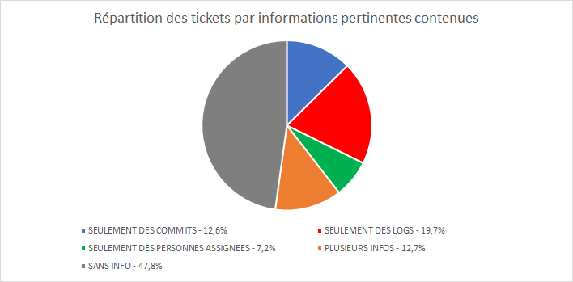

Ce diagramme permet de mettre en avant que plus de la moitié des tickets récupérés (52,2%) comportent au moins une information aidant à remonter jusqu’au code source. Ceci nous permet d’identifier également la part des tickets comportant seulement une information comme les logs par exemple. Ici 197 tickets comportent seulement des logs.

Ces résultats permettent de valider partiellement notre hypothèse, en effet les tickets de bug peuvent contenir ces informations qui nous aident à remonter au code source, mais comme on peut le voir avec les résultats, de nombreux tickets n’ont pas ces informations. Il est important que les développeurs renseignent toutes ces informations afin de faciliter l’investigation d’un bug et de remonter jusqu’au code source. 
52,2% des tickets comportent au moins l’une des trois informations, plus d’un ticket de bug sur 2 trouvés permettra potentiellement de remonter jusqu’au code source.

**Hypothèse 2**

L’hypothèse est qu’un ticket de bug permet de remonter au code source notamment avec les commits liés. Pour la vérifier, nous avons posé la question à nos sondés.

Nous avons demandé aux sondés à quelle fréquence les tickets leur permettent de trouver le code source d’un bug. D’après ces résultats, on constate que 36,4% des sondés ont répondu 3, ce qui correspond à une fréquence assez élevée, ils retrouvent la source d’un bug grâce à l’outil de ticketing assez souvent. La moyenne obtenue des réponses des sondés est de 2,03. 
Cependant les sondés précisent bien qu’il est important que l’outil de ticketing soit correctement utilisé par l’équipe. Dans le cas contraire, le ticket apporte peu d’informations et n’aide pas à remonter à la source du problème.
Ces résultats nous permettent de considérer que les tickets sont plutôt un bon moyen pour remonter au code source d’un bug que ce soit grâce aux logs ou aux commits liés.

**Hypothèse 3**

Certaines fois un ticket ne comporte pas des informations tels que les commits ou des logs, nous pensons que contacter les personnes assignées peut permettre au développeur de remonter au code source du bug.
Nous avons posé la question suivante à nos sondés :

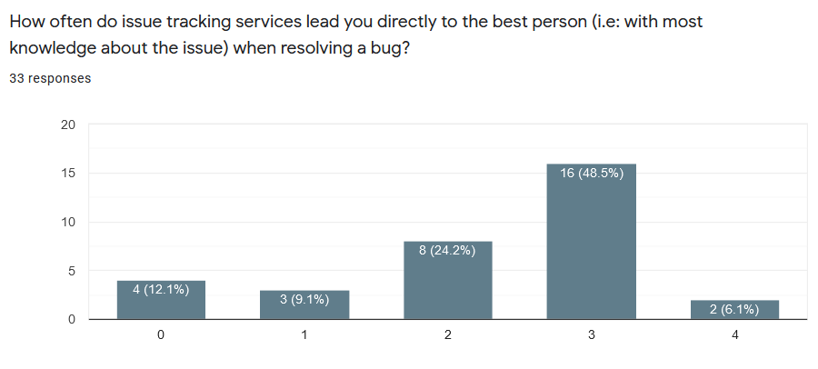

Comme on peut le voir sur le diagramme, 48,5% de nos sondés ont choisi la réponse 3 ce qui correspond à une fréquence plutôt élevée. La moyenne est de 2,27, ceci montre l’importance des tickets dans ce cas de figure.
D’après ces résultats, nous pouvons considérer que notre hypothèse est validée car la majorité de nos sondés indiquent retrouver la bonne personne grâce à l’outil de ticketing très souvent.

### **4. Qu’est-ce qu’un ticket de bug idéal ?**

**Hypothèse 1**

Comme dit précédemment, nous nous sommes intéressés à trois projets open-source et à leur manière de déclarer un nouveau ticket de bug.

On peut retrouver à la suite les templates des différents projets.

La première capture d’écran correspond au template d’un bug pour le projet ElasticSearch. Les informations importantes à renseigner pour les contributeurs sont la version de Elasticsearch, les plugins installés, les versions de la JVM utilisée mais aussi la version de l’OS du développeur. Il est demandé également de décrire le problème en indiquant ce qui était attendu et ce que le développeur a obtenu. 
Pour finir il est demandé d’ajouter les différentes étapes permettant la reproduction de cette erreur ainsi que les différents logs qu’il pourrait y avoir.

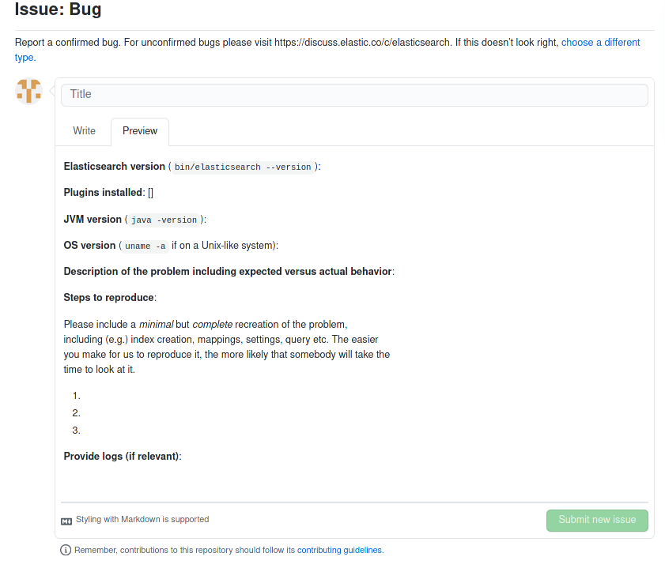

La seconde capture d’écran représente le template proposé par le projet Angular.
Les informations demandées ici sont le paquet qui est affecté par ce bug, ce qui permet de cibler directement le code source impacté. Il est demandé également de préciser si c’est ce bug constitue une régression ou non.
Comme dans l’exemple précédent, le développeur doit indiquer une description précise du bug rencontré, son environnement (ici la version d’Angular utilisée) ainsi que les potentiels logs d’erreur obtenus.
Il est important également d’ajouter une reproduction, dans ce template la reproduction du problème est proposée sous forme de Stackbliz.

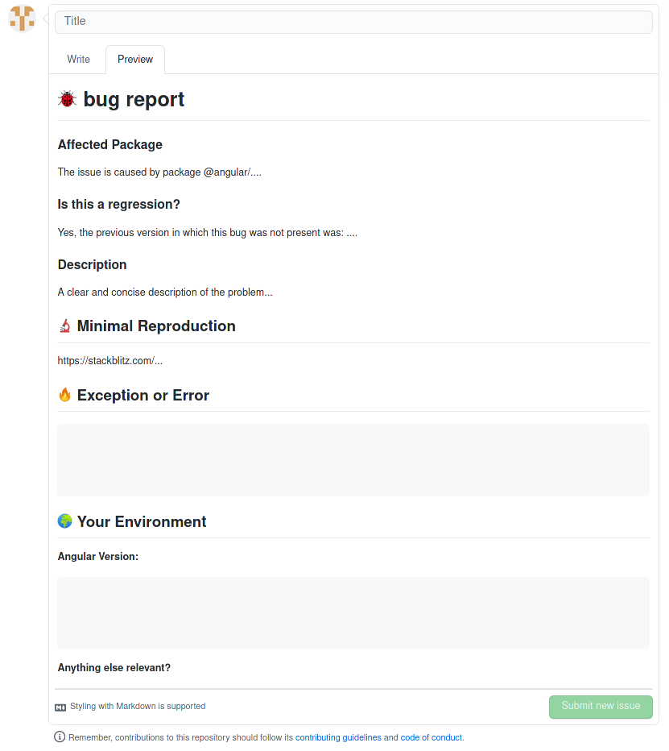

Pour finir, le dernier exemple choisi est le template du projet Electron.
On retrouve à nouveau des informations similaires aux exemples précédents comme les versions mais aussi le comportement attendu et celui obtenu. Il est important également d’ajouter les étapes de reproduction mais il est mentionné dans ce cas d’ajouter des screenshots directement des logs obtenus par exemple.

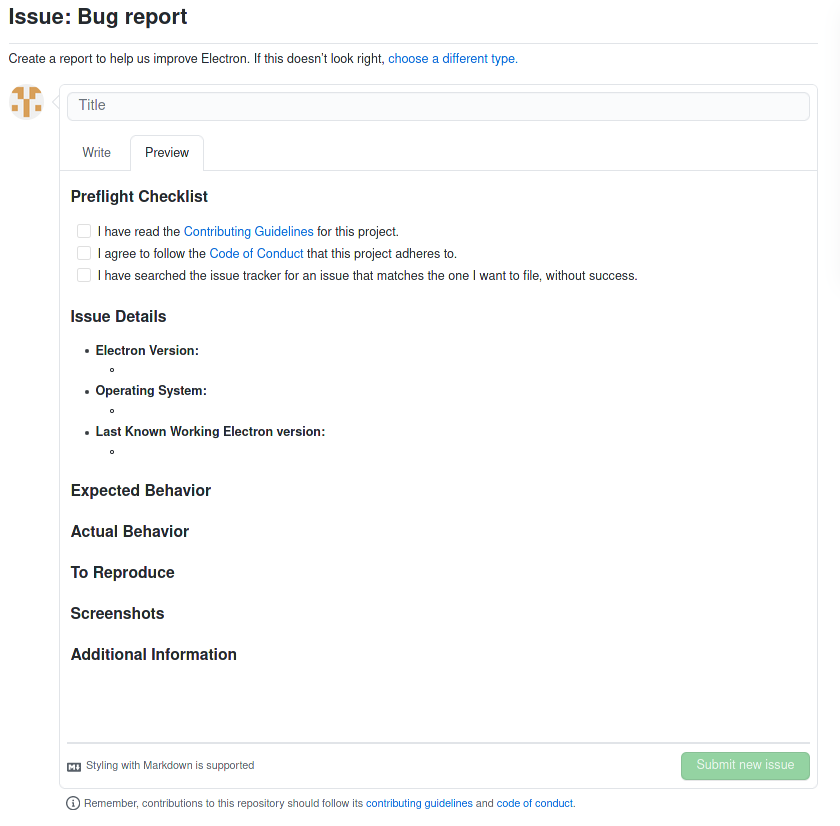

Après cette expérimentation, on se rend compte que la plupart des projets souhaitent recueillir le même type d’informations lors de la création d’un ticket de bug.
Les informations les plus importantes sont les versions que le développeur utilise lors de la rencontre de ce bug mais aussi toutes les étapes permettant de pouvoir reproduire ce bug sur une autre machine, afin de le tester.
Il est important également de décrire et de comparer le comportement attendu par rapport au comportement obtenu.

Cette expérimentation nous a permis d’identifier les points importants d’un ticket de bug et ainsi de cibler au mieux nos recherches pour les expérimentations.

## **VI. Conclusion**
La question initiale était : **“En quoi le ticketing peut être utile lors d’une investigation d’un bug?”.** Nous pouvons désormais y répondre grâce aux résultats de nos différentes sous-questions.

Nos expérimentations nous ont permis de valider en partie la plupart de nos hypothèses. Les outils de ticketing sont des outils essentiels dans la gestion d’un projet car ils permettent de s’organiser pour répartir les tâches à effectuer par exemple mais ils permettent également de garder une trace de ce qui a été fait.
Près de 70% de nos sondés considèrent qu’il est très important de créer un ticket de bug lorsqu’un problème est rencontré car ceci permet de garder une trace d’une erreur si une autre personne rencontre un jour ce même type de problème. Ceci permet également de pouvoir reproduire un bug afin de pouvoir mieux comprendre le comportement du code impacté.

Les tickets comportent de nombreuses informations, certaines sont plus utiles que d’autres comme identifiées dans une de nos sous-questions (la description du ticket, les logs, les commits liés, etc.) ; ces renseignements permettent de reproduire le bug mais aussi de retrouver les personnes ayant déjà travaillé sur un problème similaire. Plusieurs informations permettent également de remonter au code source comme les logs mais aussi les commits liés.

L’avis général que nous pouvons extraire des différentes questions posées dans notre sondage est qu’un outil de ticketing est un élément essentiel lors de l’investigation de bug. Un outil de ticketing peut s’avérer parfois fastidieux à utiliser mais ceci reste tout de même la référence la plus sûre et la plus complète.

Toutefois, il est important de garder une certaine distance avec les réponses obtenues par les développeurs, chacun a son propre avis sur les outils de ticketing et chacun a également son propre usage de ce dernier. Certains développeurs trouvent un côté trop verbeux aux outils de ticketing et n’aiment pas forcément l’utiliser et peuvent répondre que l’outil de ticketing n’est pas utile lors de l’investigation d’un bug. Il est important également de préciser que le ticketing peut être très utile pour résoudre un bug si une politique a été mise en place pour déclarer un nouveau bug et si les contributeurs ajoutent le plus d’informations possibles comme notamment des logs. 
De plus, lors de nos différentes automatisations, nous avons dû limiter le nombre de tickets recherchés car il était assez difficile de le faire à une très grande échelle. Nous nous sommes limités à 1000 tickets par recherche, il faut donc rester prudent sur les résultats obtenus pour ces expérimentations.

## **VI. Références**
1. API de GitHub : <https://docs.github.com/en/rest> 
1. Module npm utilisé pour GitHub API : <https://www.npmjs.com/package/github-api> 
1. Sondage : <https://forms.gle/jZ85DYSBEnUZ1BfbA> 
1. Répertoire GitHub du projet Angular : <https://github.com/angular/angular> 
1. Répertoire GitHub du projet Elasticsearch : <https://github.com/elastic/elasticsearch> 
1. Répertoire GitHub du projet Electron : <https://github.com/electron/electron> 
