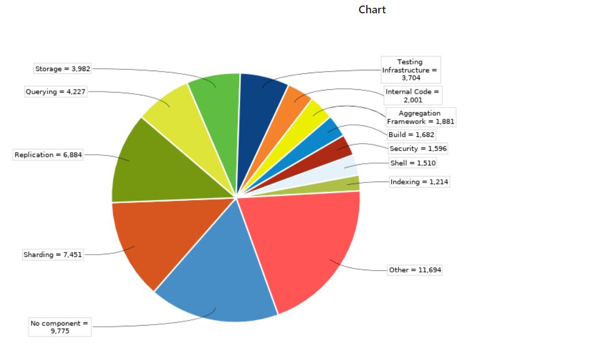
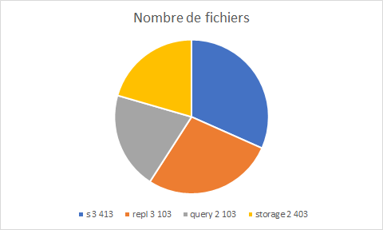
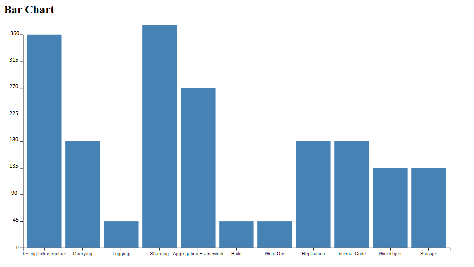
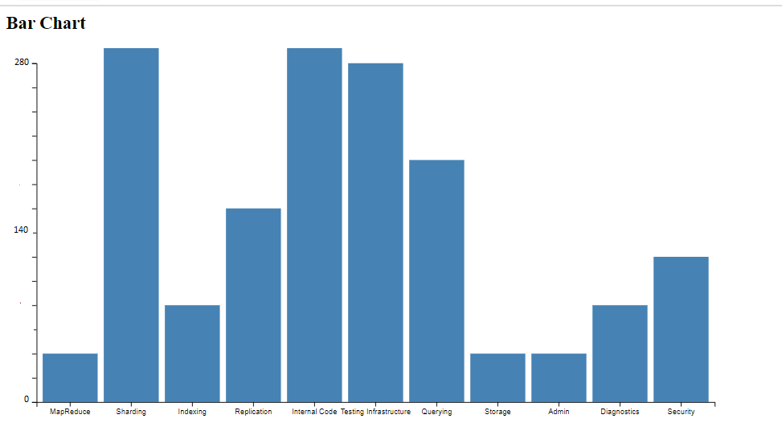
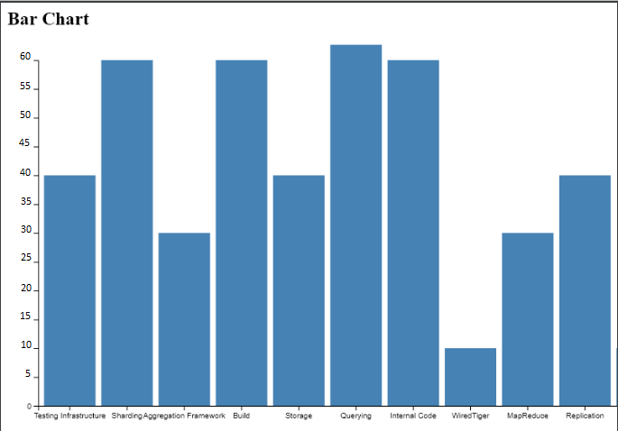

---

> **Date de rendu finale : Mars 2021 au plus tard**
> - Respecter la structure pour que les chapitres soient bien indépendants
> - Remarques :
>>    - Les titres peuvent changer pour être en adéquation avec votre étude.
>>    - De même il est possible de modifier la structure, celle qui est proposée ici est là pour vous aider.
>>    - Utiliser des références pour justifier votre argumentaire, vos choix etc.

---

**_janvier 2021_**

## Auteurs

* Rania Fekih &lt;rania.fekih@etu.unice.fr&gt;
* Anis Khalili &lt;anis.khalili@etu.unice.fr&gt;
* Gabriel Revelli &lt;gabriel.revelli@etu.unice.fr&gt;
* Robin Lambert &lt;robin.lambert@etu.unice.fr&gt;

## I. Contexte de recherche 
Comme chaque développeur, lorsque l’on est intégré à un projet qui est en cours de développement ou bien avancé, nous rencontrons des difficultés à comprendre la structure de milliers de fichiers du code source, ainsi que le mode de fonctionnement au sein de l’équipe. Les tickets sont au centre de l’organisation de tout projet, c’est pourquoi nous allons étudier les tickets pour essayer de tirer des conclusions sur l’architecture d’un projet.
Cette étude pourrait nous permettre d’avoir une meilleure vision de structure des gros projets, nous avons pris comme exemple des projets open source où nous avons accès aux tickets pour trouver des informations sur la manière dont les projets sont découpés (modules, composants, microservices...).

___

## II. Problématiques : 
Dans toutes les entreprises la période d’adaptation d’un nouvel ingénieur ou d’un ingénieur qui change de projet est estimée entre 2 et 3 semaines. Qui est une perte de temps et d’argent. C’est par là que notre question générale a été inspirée “dans quelle mesure les tickets nous renseignent sur l’architecture et l’organisation du développement d’un système ?”. 
Pour répondre à cette problématique nous avons décomposé notre problème en 4 sous problème : 
### 1. Comment peut-on distinguer les composants les plus importants dans l’architecture à partir des tickets ?
La première étape pour découvrir la composition d’un système est déjà de connaître ses composants principaux. Nous avons commencé par rassembler les tickets par composants vu que nous avons considéré nécessaire d’avoir une visualisation générale sur les composants existants avant de commencer à rentrer plus dans les détails. C’est une étape qu’on considère nécessaire pour avoir une vision globale sur leur impact dans le système général. 
### 2.Une fois qu’on trouve les composants qui ont des tickets en commun, peut-on identifier un couplage ?
Une partie que nous considérons nécessaire dans le processus de compréhension et de découverte de l’architecture d’un système est le couplage entre composants. Analyser les tickets en communs entre composants peut éventuellement nous aider à poser des hypothèses sur le couplage et la relation entre les composants en question. 
### 3. Comment peut-on identifier les composants qui sont en évolution ?
Après avoir une idée générale sur l’architecture globale de l’application, c’est intéressant de voir l’évolution des composants dans les dernières années qui sera généré à partir du nombre de fonctionnalités ajoutées par composant.

### 4. Comment peut-on évaluer l’implémentation d’un composant ?
Enfin, il est intéressant de se focaliser sur un composant donné. Consulter les différents types de tickets existants et comparer les chiffres par rapport à la taille de ce composant. Lors de l’investigation nous avons trouvé que les types de tickets qui peuvent nous renseigner au plus sur la qualité d’un composant sont les tickets de type bug et les tickets de type improvement. 

___
##  III. Collecte d’informations
Au début du projet nous avons commencé par explorer le ticketing du projet mongodb hébergé sur Jira. Nous avons choisi ce projet parce qu'il est open-source et qu’il dispose d’une grande variété de tickets à analyser. Ce projet contient également 9 sous-projets qui ont tous leurs propres composants. 
Les outils utilisés sont :
La documentation de l’API Jira
Le projet Firefox sur bugzilla 
La thèse “Evolution structurelle dans les architecture logicielle à base de composants” publié sur HAM le site des archives ouvertes
Le projet mongoDb sur jira
Nous avons également créé deux programmes qui permettent d’analyser le gestionnaire de ticket Jira. Pour l’élaboration de ces programmes nous avons eu besoin de l’API de Jira pour récupérer des informations sur les tickets d’un projet et également de la librairie d3-node sur nodeJS pour afficher des graphiques utiles à l’analyse de ces tickets.
___
## IV. Hypothèses & Experiences


### 1.Comment peut-on distinguer les composants les plus importants dans l’architecture  ?

#### Hypothèse 

Notre première intuition c’est que les composants qui ont plus de ticket sont des composants de valeur importante dans un projet .

#### Expérimentation

Pour vérifier cette hypothèse nous avons expérimenté ceci à travers notre propre serveur d’analyse qu’on a développé en passant dans le coeur de la requête 
le nom de l’API et du projet sur lequel on va faire notre expérimentation:
```json
{
 "APIJira" : "https://jira.mongodb.org/rest/api/2/search",
 "ProjectName":"SERVER"
}
```

``` FILTER : APIJira+"?jql=" "project = "+ProjectName +" AND component is not EMPTY"; ```


### 2.Une fois qu’on trouve les composants qui ont des tickets en commun, peut-on identifier un couplage ?

#### Hypothèse n°1 
Nous avons l'intuition que si deux composants  partagent un nombre assez important de tickets, ils peuvent éventuellement être couplés
#### Expérimentation
Pour vérifier intuitivement notre hypothèse, nous avons utilisé l’API de jira pour récupérer les tickets qui sont partagés entre deux composants, et nous avons commencé par analyser à la main les “include” dans les fichiers du code source du projet associés au lien github. L’objectif était de vérifier à la main dans un premier temps s' il était possible d’identifier du couplage entre les composants en regardant le code.

``` FILTER : "project = "+ProjectName +" AND component="+ principalComponent+ " AND component in ("+componentsNames+")"; ```

Après la récupération des tickets,  nous avons récupéré les liens github associés et nous les avons passés à notre algorithme pour analyser et extraire les includes qui existent. 
Dans les informations d’un ticket nous avons une liste de composants liés à ce ticket. Nous allons donc essayer de prouver réellement que le fait de citer plusieurs composants dans un même ticket indiquent qu’ils sont couplés. 

Nous nous sommes rendus compte que nous ne savions pas à quel composant appartiennent les fichiers du code source (le code n’est pas organisé de façon à différencier clairement les composants). 

Nous avons trouvé une solution efficace pour résoudre ce problème: récupérer les liens Github en descriptions des tickets vers les fichiers du code source, et associer ces fichiers au composant du ticket.

Une fois que nous aurons établi un lien entre les chemins des fichiers du code source et les composants du projet, nous pourrons identifier, dans les imports, les composants associés à ces fichiers, et valider notre hypothèse de couplage. 

Nous ne pouvons évidemment utiliser cette technique que sur les tickets liés à un seul composant.

Ensuite nous récupérons tous les tickets qui référencent deux composants avec des liens Github présents. On cherche, grâce aux données recueillies à la phase précédente, à associer le fichier à un composant cité par le ticket, ensuite on vérifie dans ses imports qu’il est bien associé aux autres composants et si c’est le cas on peut parler d’un couplage. Cela permet de nous donner un bon indicateur de couplage ou non.

#### Hypothèse n°2

Si deux composants sont liés à plusieurs reprises à des tickets de type bugs avec priorité P1 ou P2, le couplage entre ces deux composants peut être nommé couplage fort.

#### Expérimentation

Pour vérifier cette hypothèse nous avons fait exactement la même démarche qu’auparavant. Mais malheureusement les includes ne sont pas suffisants pour définir un couplage fort. Donc nous avons décidé d’éliminer cette hypothèse. 

### 3.Après avoir une idée sur les différents composants, comment peut-on identifier les composants qui sont en évolution ?

#### Hypothèse n°1
Nous avons l’intuition que les composants qui ont le plus de tickets de type new feature sont les composants de système qui sont actuellement en état d’évolution. 

#### Expérimentation
Pour vérifier cette hypothèse, nous avons demandé à notre entourage et lu quelques articles pour comprendre au plus l’utilisation des du label new-feature. Tout le monde a été d’accord que c’est un label qui est utilisé à l’ajout d’une nouvelle fonctionnalité à un composant. 

### 4.Comment peut-on évaluer l’implémentation des composants ?

#### Hypothèse n°1

Notre première hypothèse c’est qu' un composant qui a plusieurs tickets de type bugs , la qualité de son code peut être considérée comme non optimale. 

#### Expérimentation

Pour vérifier cette hypothèse , nous allons comparer par année les composants qui ont plus de bugs vs les composants qui ont le plus de tickets de type improvement . Nous allons nous focaliser seulement sur les deux dernières années. Donc pour prouver cela la première étape était d’appliquer les filtres ci-dessous pour récupérer le nombre de tickets bug pour chaque composants du projet “server”.

``` FILTER  : APIJira+"?jql=""project = "+ProjectName +" AND issuetype = Bug AND component is not EMPTY AND created >= \"2019/01/01 00:00\" AND created < \"2019/12/31 23:59\""; ```

``` FILTER  : APIJira+"?jql=""project = "+ProjectName +" AND issuetype = Bug AND component is not EMPTY AND created >= \"2020/01/01 00:00\" AND created < \"2020/12/31 23:59\""; ```

Après, nous avons fait des expérimentations sur le même projet en modifiant les le type par improvement.

``` FILTER :  APIJira+"?jql="project = "+ProjectName +" AND issuetype = Improvement AND component is not EMPTY AND created >= \"2019/01/01 00:00\" AND created < \"2019/12/31 23:59\"" ```

``` FILTER : APIJira+"?jql="project = "+ProjectName +" AND issuetype = Improvement AND component is not EMPTY AND created >= \"2020/01/01 00:00\" AND created < \"2020/12/31 23:59\"" ```
___
## V. Result Analysis and Conclusion Tout le monde 

### Comment peut-on distinguer les composants les plus importants dans l’architecture ?

Pour répondre à l’hypothèse “le composant qui a le plus de tickets est le composant le plus important” nous avons commencé par appliquer le filtre qu’on a précisé auparavant au projet SERVER de mongodb et nous avons dégagé ce graph : 



graphe des 4 premières lignes : 



Le s représente le sharding et repl représente la réplication. Donc ceci vérifie bien notre hypothèse. Dans la sous question suivante nous allons expliquer comment nous avons associé les dossiers à leur composant. 

### Une fois qu’on trouve les composants qui ont des tickets en commun, peut-on identifier un couplage ?

Pour répondre à cette question, nous avons développé un programme en NodeJS qui fonctionne en deux étapes. 

La première est permet d’identifier un lien entre les composants décrits dans le gestionnaire de tickets et les dossiers du projet MongoDB sur GitHub. Parfois ce lien est évident, mais il ne l’est pas nécessairement, ce qui justifie l’utilisation d’un tel outil. En sortie de cette première étape nous avons un fichier JSON dans lequel se trouve les composants et les chemins des fichiers auxquels ils sont liés. Nous considérons que tous les fichiers d’un chemin sont liés à un composant si le chemin apparaît en majorité pour ce composant dans notre fichier. Nous avons choisi d’utiliser 1000 tickets pour identifier les liens entre composants et chemins. Le résultat est un fichier visible sur notre github (https://github.com/RobinLambert1/retro-ingenerie-ice-breaker/blob/main/coupling/results%20samples/result-10000.json).

La seconde partie permet de vérifier l’hypothèse d’un couplage entre composants. Dans le cadre de notre étude, nous avons choisi de nous restreindre aux tickets qui concernent 2 composants. Pour chacun de ces tickets, nous récupérons les liens github associés si il y en a, et nous utilisons notre fichier JSON pour lier le fichier du code source du projet de MongoDB modifié sur Github à l’un des deux composants du ticket. Ensuite, nous vérifions le couplage réel entre ces composants en regardant les fichiers “include” dans le code source et en les liant à un composant, de la même façon. L’API de Jira ne permet pas de recevoir tous les tickets du projet SERVER en une seule requête. Au total, 51849 tickets sont liés au projet, et nous pouvons en récupérer 10 000 simultanément avec un peu de chance (parfois la requête ne passe pas…). 

Nos résultats pour 10 000 tickets ne sont pas particulièrement concluants. Le fichier JSON en sortie du deuxième algorithme est disponible sur github. Seulement 115 tickets sont liés à deux composants, et 28 d’entre eux ont un lien github… Parmi ces 28 tickets, notre hypothèse a pu être validée pour seulement 5 d’entre eux (environ ⅙). Nous pensons ne pas avoir suffisamment de données pour pouvoir conclure quoi que ce soit à propos de notre hypothèse.

### Après avoir une idée sur les différents composants, comment peut-on identifier les composants qui sont en évolution ?
Pour distinguer les composants qui sont en évolution nous avons filtré les tickets de type “new feature”et par année 2020. Nous avons rassemblé ces données par composant. 


En utilisant cet article : https://tel.archives-ouvertes.fr/tel-00488005/document Nous avons dégagé cette définition pour l’évolution de l’architecture qui nous confirme nos résultats : l’évolution logicielle est la possibilité de pouvoir élargir les systèmes et d’appliquer le passage à l’échelle, pour prendre
 en compte de nouveaux besoins ou des fonctionnalités plus complexes. Ceci nous confirme que les tickets qui ont le plus de tickets new feature ( nouvelle fonctionnalité ) sont des composants en évolution. 

### Comment peut-on évaluer l’implémentation d’un composant ?
Comme nous l'avons précisé auparavant afin de prouver notre hypothèse nous avons opté pour une comparaison entre les composants qui ont plus de tickets de type bug vs les composants qui ont le plus des tickets de type improvement. Nous avons commencé par l’année de 2020 après nous avons exercé la même procédure sur l’année 2019. 
Bugs 2020



Improvement 2020



Nous pouvons remarquer ici qu’il y a pas mal de composants qui s’affiche dans les deux graphes. Nous avons : 
- Le composant sharding qui a +360 tickets bugs et qui a de même +280 
- Le composant replication qui a +180 tickets de bugs et +140 tickets de improvement. 
- Le composant testing infrastructure qui a +360 tickets de bugs et +260 tickets de “improvement” 
- Le composant storage qui a +135 de tickets bug et qui +40 ticket d’improvement 
- Ce qui nous prouve à ce stade que notre hypothèse est bien valide. Nous allons terminé l’analyse avec l’année 2019

Bugs 2019


Improvement 2019 



Pareil ici nous avons un nombre important de composants qui s’affichent dans les deux graphes : 
Le composants querying a +360 tickets de types et il a +60 tickets d’improvement 
Le composant replication +360 tickets de bugs et il a +40 tickets d’improvement 
Le composant storage qui a +120 tickets de bugs et qui 40 tickets d’improvement 
Il y aussi testing infrastructure et sharding 
Donc jusque là nous avons des chiffres qui vérifient bien notre hypothèse mais nous avons décidé de voir des articles publiés sur internet qui peuvent nous confirmer cela. Nous avons l’article ref4 ( indiqué dans les références)   ou les nombre de bugs est marqué comme un métrique d’évaluation de la qualité de code et ce dernier nécessite éventuellement des tâches d’amélioration ( partie 3.7 ). 

___

## VI. Tools \(facultatif\)

Précisez votre utilisation des outils ou les développements \(e.g. scripts\) réalisés pour atteindre vos objectifs. Ce chapitre doit viser à \(1\) pouvoir reproduire vos expérimentations, \(2\) partager/expliquer à d'autres l'usage des outils.

### Notre serveur d’analyse:

Au lieu de visualiser les tickets et les informations reliées à un projet Jira à la main et directement en modifiant à chaque fois les filtres . Nous avons développé nos propres serveurs d’analyse qui permet à partir d’une Api jira et un nom de projet choisi de retourner  plusieurs graph permettant d'avoir une observation et des renseignements  sur l’architecture et la structure du système.

Ce serveur permet de générer 3 ensemble de graph différents :

#### /generalData :
Elle prend au coeur de la requête 2 attributs:
```json
{   
    "APIJira" : "https://jira.mongodb.org/rest/api/2/search",
    "ProjectName":"SERVER"  
}
```

cette requête permet d'exécuter plusieurs filter ( on a intégré 18 filter) appelé GeneralFilter , 
ce type de filtre est appliqué à tous les composant du projet exemple :
nombre de ticket bug par composant par années ( 2019 2020 ).
nombre de ticket bug avec priorité P1 et P2
nombre de ticket improvement par années ( 2019 2020 )
nombre de ticket new feature
=> se sont les filtres utilisés dans notre analyse.

#### /specificDataComponents:
Elle prend au coeur de la requête 4 attributs:
```json
{   
    "APIJira" : "https://jira.mongodb.org/rest/api/2/search",
    "ProjectName":"SERVER",
    "principalComponent" : "Sharding",
    "otherComponents" : ["Replication", "Security", "Querying", "Storage", "Testing Infrastructure", "Aggregation Framework", "build", "Shell"] 
}
```
Cette requête permet d'exécuter plusieurs filter ( on a intégré 2 filter) appelé SpecificFilter .Ces filtres nous permettent de faire une observation de la relation entre un composant principal choisi et un ensemble de composant secondaire exemples:
nombre de bug partagé entre un composant et les autre composant 
nombre de bug critique et bloquante partagé entre un composant et les autres


#### /specificDataTwoComponents:
Elle prend au coeur de la requête 4 attributs:
```json
{  
    "APIJira" : "https://jira.mongodb.org/rest/api/2/search",
    "ProjectName":"SERVER",
    "firstComponent" : "Sharding",
    "secondComponent" : "Replication"    
}
```
Cette requête permet d'exécuter plusieurs filter ( on a intégré 2 filter) appelé SpecificFilterOneToOne.

Ces filtres nous permettent de faire une observation de la relation entre deux composant choisi, exemples:
nombre de lien entre 2 composants

### Fonctionnement interne 
 ce serveur d’analyse reçoit en entrée le types de filtres exécuter après il fait le parsing des du fichier json retourné par l’API Jira 
ensuite il stocke ces données dans des fichiers.csv qui prend le nom des filtres et génère à la fin les graph détaillés pour faire l’observation facilement.

Ce mécanisme est automatique et il peut être appliqué à n'importe quel projet jira il suffit juste de préciser l’api jira et le nom du projet à analyser.

### Pour lancer le projet :
```shell
cd jira_api_automation 
npm install
npm start
```
Lien vers la collection postman : https://www.getpostman.com/collections/9cca438d452ea0dc099c

___
## VII. Références

1.https://tel.archives-ouvertes.fr/tel-00488005/document

2.https://developer.atlassian.com/server/jira/platform/rest-apis/

3.https://jira.mongodb.org/projects/SERVER/issues

4.http://www.ra-innovation.uliege.be/2018/wp-content/uploads/sites/4/2019/09/Me%CC%81triques-et-crite%CC%80res-de%CC%81valuation-de-la-qualite%CC%81-du-code-source-dun-logiciel.pdf
