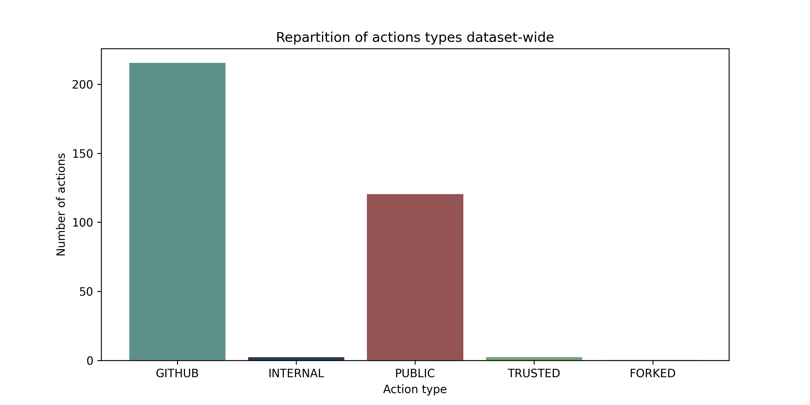
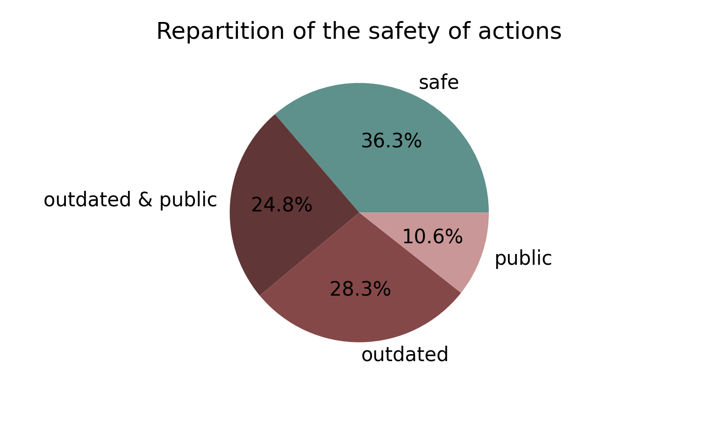
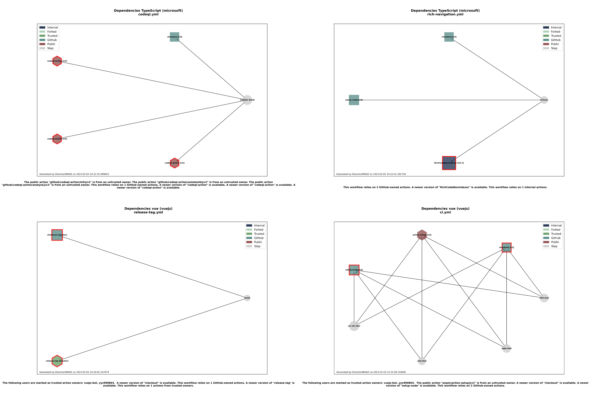
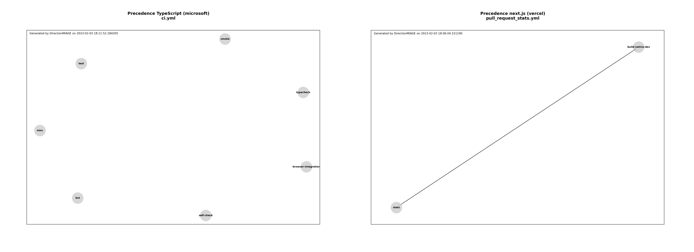
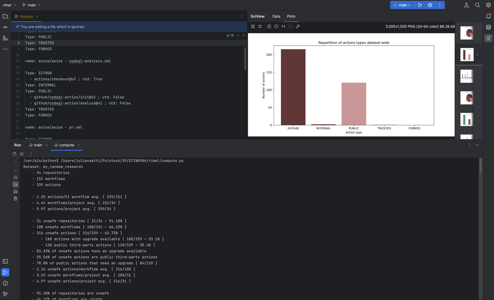

**_février 2023_**

## Auteurs

Nous sommes cinq étudiants en dernière année à Polytech Nice-Sophia specialisés en Architecture Logicielle (AL) :

- Antoine Amiard ([@AntoineAmiard](https://github.com/AntoineAmiard)),
- Romain Kugler ([@romainkugler](https://github.com/romainkugler)),
- Pierre-Yves Munoz ([@pyMNZ](https://github.com/pyMNZ)),
- Julien Satti ([@juliensatti](https://github.com/juliensatti)).

## I. Contexte

L'intégration continue (CI) est de plus en plus utilisée et préconisée dans l'utilisation de dépôts de contrôle de
version (type GitHub, GitLab...). Au fil des années, de nouveaux outils ont été implémentés dans les langages
descriptifs d'intégration continue (type GitHub Actions, GitLab CI/CD ; tous deux sous le format YAML). Un de ces ajouts
réside la réutilisation d'étapes/actions (steps) au travers d'actions partagées/"empaquetées" par la plateforme, par des
tiers ou par nous même dans un autre dépôt par exemple (mot clé ``uses``).

Ainsi, avec cette réutilisation d'actions au travers des fichiers d'intégration continue, nous nous sommes posés la
question de la maintenabilité de ces fichiers. En effet, si une action est modifiée, il faut modifier tous les fichiers
d'intégration continue qui l'utilisent. De plus, si une action est supprimée, il faut la supprimer tous les fichiers
d'intégration continue qui l'utilisent (ou en trouver une autre). Même chose si elle est déplacée ou mise à jour. Cela
peut vite devenir un problème.

Nous nous sommes donc demandés s'il était possible de visualiser les dépendances en actions dans chaque tâche d'un
fichier d'intégration continue, avec pour chaque action empaquetée détectée : leur origine, leur niveau de confiance
associée et si elles sont à jour ou non. Nous avons donc décidé de développer un outil permettant de répondre à cette
problématique.

Pour ajouter à cela, nous réaliserons également une visualisation plus parlante de la précédence de chaque tâche (job)
au sein d'une chaîne d'intégration continue.

## II. Question générale

**"Comment visualiser les dépendances d’une chaîne d’intégration continue, leur origine et leur niveau de confiance ?"**

Cette question a le mérite d'être très large et de couvrir plusieurs problématiques. Nous avons donc décidé de la
décomposer en plusieurs sous questions plus précises :

1. Comment détecter l’obsolescence de l’implémentation d’une tâche dans une chaine d’intégration continue ?
2. Comment s’assurer de la pérennité des tâches tierces dans une chaîne d’intégration continue ?
3. Comment représenter toutes ces informations clairement sous forme de graphes ?

Au terme de ce projet, nous espérons pouvoir répondre à ces questions et ainsi fournir un outil permettant de proposer
une visualisation viable de la chaîne d'intégration continue de n'importe quel projet (sur GitHub — pour le moment).

## III. Recueil des données

Pour réaliser cette recherche, nous nous sommes focalisés sur un corpus de 34 dépôts jugés populaires (en nombre
d'étoiles sur GitHub ou en notoriété). Il s'agit de : *public-apis/public-apis, vercel/next.js, twbs/bootstrap,
ytdl-org/youtube-dl, vuejs/vue, vuejs/docs, vuejs/router, microsoft/FluidFramework, microsoft/TypeScript,
microsoft/winget-cli, microsoft/fluentui-react-native, microsoft/azuredatastudio, microsoft/vscode,
collet/cucumber-demo, mathiascouste/qgl-template, vitest-dev/vitest, i18next/next-i18next,
jwasham/coding-interview-university, EbookFoundation/free-programming-books, flutter/flutter, mobileandyou/api,
facebook/react, freeCodeCamp/freeCodeCamp, d3/d3, mui/material-ui, trekhleb/javascript-algorithms, mantinedev/mantine,
mattermost/mattermost-server, pynecone-io/pynecone, TheAlgorithms/Python, stefanzweifel/git-auto-commit-action,
axios/axios, raspberrypi/linux et kamranahmedse/developer-roadmap*.

Nous avons ensuite récupéré les fichiers d'intégration continue de ces dépôts (``.yml`` et ``.yaml``) et les avons
analysés. Puis, nous avons extrait les actions utilisées dans ces fichiers d'intégration continue. Enfin, grâce à l'API
GitHub, nous avons récupéré les informations sur ces actions (origine, niveau de confiance, version et version upstream,
etc).

La motivation de ce projet de recherche est axée en partie sur un cas d'école concernant la disparition d'un paquet sur
npmjs [1]. Ce problème est transposable à GitHub, où les actions sont également hébergées et détenues par différentes
sources. Il est donc important de pouvoir détecter les actions qui ne sont pas issues de sources fiables et/ou durables.
Nous avons ajouté à cette problématique les enjeux de sécurité au travers des informations de mise à jour des actions et
de leur niveau de confiance.

Afin de réaliser ces analyses, nous avons donc utilisé les outils suivants :

- un analyseur de fichiers d'intégration continue (``.yml`` et ``.yaml``) propriétaire, développé en Python, permettant
  de récupérer les actions utilisées dans les fichiers d'un corpus de dépôts ;
- l'API GitHub permettant de récupérer les fichiers de workflows et les informations de release des actions ;
- un dernier script Python permettant d'agréger les résultats du premier script pour en faire une visualisation plus
  parlante et ensembliste.

## IV. Hypothèses & Expériences

### Hypothèses

H1 : Les actions fournies par GitHub (dépôt ``actions``) sont les plus utilisées dans les fichiers d'intégration
continue.

H2 : Les dépôts les plus populaires de GitHub apportent une attention particulière à la mise à jour de leurs fichiers
d'intégration — notamment en cas de mise à jour d'actions externes utilisées en leur sein.

H3 : Les actions publiques, c'est-à-dire celles qui sont disponibles pour tous les utilisateurs de GitHub, mais qui ne
proviennent pas de GitHub directement et qui sont donc plus à risque de disparaître, sont moins utilisées que les
actions privées et fournies par GitHub réunis.

### Expériences

H1 : Compiler au travers des fichiers d'intégration continue les plus populaires de GitHub une répartition du type d'
actions utilisées.

H2 : Compiler en plus des visualisations unitaires pour chaque fichier d'intégration continue une visualisation globale
de l'ensemble des fichiers d'intégration continue qui utilisent des actions catégorisées de "non sûres" (actions
publiques, actions non mises à jour, actions publiques non mises à jour...).

H3 : Générer une visualisation générale, par dépôt, de la répartition des types d'actions utilisées et une autre,
globale, pour montrer la tendance générale.

## V. Analyse des résultats & Conclusion

### 1. Présentation des résultats

Grâce aux outils qui ont été créés pour répondre à nos questions, nous avons pu obtenir les résultats suivants :

* une visualisation de la répartition des types d'actions utilisées dans les fichiers d'intégration continue des dépôts
  les plus populaires de GitHub ;
* une visualisation de la répartition du niveau de confiance des actions utilisées dans les fichiers d'intégration
  continue des dépôts les plus populaires de GitHub ;
* une visualisation de la répartition des types d'actions utilisées, par dépôt, des dépôts les plus populaires de
  GitHub ;
* des statistiques globales sur la répartition des types d'actions utilisées dans les fichiers d'intégration continue
  des dépôts les plus populaires de GitHub.

Le corpus de dépôts utilisé pour réaliser ces visualisations se base une écrasante majorité de dépôts de projets
open-source et populaires (étoiles), ce qui peut expliquer les résultats obtenus. Il est composé de :

| Indice                          | Valeur |
|---------------------------------|--------|
| Dépôts                          | 34     |
| Fichiers d'intégration continue | 151    |
| Actions                         | 339    |
{: .tg}

Les statistiques globales obtenues sont les suivantes :

| Indice                        | Valeur |
|-------------------------------|--------|
| Nombre d'actions par workflow | 2.25   |
| Nombre d'actions par dépôt    | 9.97   |
| Nombre de workflows par dépôt | 4.44   |
{: .tg}

Cela signifie que, en moyenne, un dépôt utilise 9.97 actions dans 4.44 fichiers d'intégration continue.

Les types d'actions utilisées sont variées :

| Type d'action      | Nombre d'occurrences | Pourcentage |
|--------------------|----------------------|-------------|
| GitHub             | 215                  | 63.4%       |
| Publique           | 120                  | 35.4%       |
| Privée/Interne     | 2                    | 0.59%       |
| Tiers de confiance | 2                    | 0.59%       |
| Forkée             | 0                    | 0%          |
{: .tg}

*On notera ici que le concept de "tiers de confiance" est un concept qui n'a pas été utilisé très largement dans le
cadre de ce projet, mais qui pourrait être intéressant à explorer. Il convient à chaque propriétaire de dépôt de définir
les utilisateurs qui sont tiers de confiance et dont leurs actions seraient considérées comme sûres. Cela permettrait de
définir des actions publiques comme sûres par le propriétaire du dépôt, comme par exemple des actions émanant de comptes
affiliés à l'organisation du dépôt (robots, créateur unique, etc.).*

> 🧩 Un exemple de workflow utilisant une action tiers de confiance est le workflow
> de [vuejs/vue/release-tag.yml](assets/results/my_random_research/vuejs/vue/dependencies/release-tag.png) qui utilise
> l'action ``release-tag`` du dépôt ``yyx990803``, ce dernier étant l'unique mainteneur majoritaire du projet.

Les conséquences pour la sûreté des actions utilisées sont les suivantes :

| Indice                                                   | Valeur | Pourcentage                           |
|----------------------------------------------------------|--------|---------------------------------------|
| Nombre d'actions par workflow non sûres                  | 2.16   | -                                     |
| Nombre d'actions non sûres par projet                    | 6.97   | -                                     |
| Nombre de workflows non sûrs                             | 3.23   | -                                     |
| Nombre d'actions non sûres                               | 216    | 63.72% de toutes les actions          |
| Nombre de dépôts avec des workflows non sûrs             | 31     | 91.18% de tous les dépôts             |
| Nombre de workflows non sûrs                             | 3.23   | 66.23% de tous les workflows          |
| Nombre d'actions avec une mise à jour majeure disponible | 180    | 53.3% de toutes les actions           |
| Nombre d'actions publiques non mises à jour              | 84     | 70.0% de toutes les actions publiques |
{: .tg}

### 2. Interprétation

#### 2.1. H1 — Répartition des types d'actions

La répartition des types d'actions par dépôt sous forme de diagramme de barres, nous permet, en numéraire, de visualiser
clairement les types d'actions dominants. Il montre en effet ici que les actions fournies par GitHub sont bien les plus
utilisées, mais que les actions publiques sont également très utilisées.

{: .tgimg}

Cela peut s'expliquer par le fait que les actions publiques sont plus faciles à trouver sur des sources de savoir
alternatives (type forum) et à utiliser que les actions privées, mais aussi par le fait qu'elles sont plus flexibles et
nombreuses (car créées par la communauté) que les actions fournies par GitHub.

**Ces résultats sont très inquiétants, car cela signifie que les actions utilisées dans les fichiers d'intégration
continue des dépôts les plus populaires de GitHub sont à risque en utilisant une très grande proportion d'actions
publiques. Malgré cela, l'hypothèse de départ est confirmée : les actions les plus utilisées dans les fichiers
d'intégration continue des dépôts les plus populaires de GitHub, en général, provient du dépôt ``actions`` que l'on
assimile à des actions sûres.**

#### 2.2. H2 — Répartition du niveau de confiance des actions

La répartition du niveau de confiance des actions montre qu'au travers des 339 actions étudiées, dans les 34 dépôts du
corpus, 216 actions sont à risque ! Parmi ces 216 actions, 120 sont des actions publiques et 180 sont des actions avec
une mise à jour disponible. Cela représente 2.16 actions à risque par workflow, ce qui est un chiffre assez élevé au vu
de la moyenne de 2.25 actions par workflow !

{: .tgimg}

En d'autres termes, sur toutes les actions du corpus, environ 64% sont à risque. Cela représente plus de 66% de
workflows à risque et 91.18% des dépôts du corpus. Cette répartition est très inquiétante et montre que les actions
utilisées dans les fichiers d'intégration continue sont très peu mises à jour et que les actions publiques, qui
n'émanent pas d'une origine à faible chance de disparaitre sans avertissement, sont très utilisées.

**Ces résultats contredisent donc notre hypothèse H2. L'attention des propriétaires des depots les plus populaires ne
semble pas accorder un effort plus important sur la sécurisation de leurs fichiers de workflow.**

#### 2.3. H3 — Répartition des types d'actions par dépôt

En comparant au travers d'un diagramme de barres les types d'actions utilisés par dépôt, on peut plus facilement
discerner les dépôts qui utilisent beaucoup d'actions publiques et celles qui utilisent beaucoup d'actions fournies par
GitHub — mais surtout la proportion de chacune.

{: .tgimg}

La répartition des types d'actions par dépôt montre que les actions publiques sont très utilisées, mais que les actions
fournies par GitHub restent en majorité, proportionnellement, les plus utilisées. Cela peut s'expliquer par le fait que
les actions publiques sont plus faciles à trouver et à utiliser que les actions privées, mais aussi par le fait que les
actions publiques sont plus flexibles et nombreuses que les actions fournies par GitHub.

**Ces résultats sont aussi inquiétants et contredisent en partie notre hypothèse H3. En effet, malgré une bonne
proportion d'actions fournies par GitHub, les actions publiques sont très utilisées et surpassent la proportion
d'actions internes/privées (mais pas celles de GitHub), en général. MaterialUI par exemple, a plus d'actions publiques
que d'actions GitHub et internes combinées, ce qui contredit totalement notre hypothèse.**

### 3. Conclusion

Les résultats de notre étude montrent que les actions utilisées dans les fichiers d'intégration continue des dépôts
GitHub sont très peu mises à jour et que les actions publiques qui n'émanent pas d'une origine à faible chance de
disparaitre sans avertissement, sont très utilisées. Cela représente plus de 66% de workflows à risque et 91.18% des
dépôts du corpus.

Une véritable attention doit être portée sur l'origine des actions utilisées dans les fichiers d'intégration continue
des dépôts GitHub. En effet, les actions publiques sont très utilisées et ne sont pas mises à jour régulièrement. De
plus, les actions publiques ne sont pas toujours issues d'une source fiable. Il est donc important de vérifier l'origine
des actions utilisées. Il est également important de mettre à jour constamment les actions utilisées dans les fichiers
d'intégration continue des dépôts GitHub, peu importe leur origine.

La pérennité des actions utilisées dans les fichiers d'intégration continue des dépôts GitHub est également un point
important. En effet, si une action est supprimée, le workflow ne sera plus fonctionnel. Il est donc important de
vérifier que les actions utilisées dans les fichiers d'intégration continue des dépôts GitHub sont de sources fiables.
On souhaite en effet éviter que des actions soient supprimées sans avertissement comme cela a été le cas pour npmjs et
le package `left-pad` en 2016 qui a causé des problèmes à de nombreux projets qui se sont retrouvé en manque d'une
dépendance avec toutes les conséquences que cela provoque [1] [2]. La même chose est arrivée pour les paquets `colors`
et `fakerjs` en 2022 [3].

Cette conclusion nous permet de répondre clairement à nos trois questions :

1. les visualisations générées et générables à la demande permettent de vérifier d'un coup d'œil la présence d'actions
   obsolètes dans des fichiers d'intégration continue de dépôts GitHub ;
2. les visualisations générées et générables à la demande permettent de vérifier la provenance des actions utilisées
   dans de fichiers d'intégration continue de dépôts GitHub et donc de vérifier si elles sont fiables (dans le sens
   sécurité de traitement et pérennité) ;
3. nous obtenons une visualisation complète des dépendances inter workflow (précédence des actions) et des graphes de
   dépendances enrichis par des informations sur les actions utilisées au sein des fichiers d'intégration continue de
   dépôts GitHub.

La prochaine fois que vous utiliserez une action externe dans un fichier d'intégration continue de dépôt GitHub, pensez
à vérifier sa provenance et à la mettre à jour régulièrement, de la même manière que vous le feriez pour une dépendance
plus classique pour du code source.

> ⭐️ **Nous vous invitons à consulter le fichier [`results.md`](assets/results/my_random_research/results.md) pour plus de
détails atomiques, dépôt par dépôt, sur les résultats obtenus, [ici](assets/results/my_random_research/results.md).**

## VI. Outillage

Afin de réaliser ce projet, nous avons créé des outils permettant de détecter les actions utilisées dans un fichier
d'intégration continue, de les analyser et de les visualiser.

### 1. Génération des visualisations et des résultats

Pour générer les visualisations et les résultats, nous avons utilisé le script `main.py` qui permet de récupérer les
informations sur les actions utilisées dans les fichiers d'intégration continue des dépôts GitHub (importés dans un
fichier de recherche sous format YML). Pour cela, nous avons utilisé l'API GitHub et le langage Python.

Il suffit de créer un corpus de dépôts dans le format YML suivant :


name: "My Research Corpus"

subjects:

your_group_name:
repositories:
- "repo_owner/repo_name"

your_group_name_advanced:
repositories:
- "repo_owner/repo_name"
trusted-owners:
- "github_username"


Puis de lancer le script `main.py` avec le fichier YML en paramètre :


python3 main.py -P my_corpus.yml


Le script va alors récupérer les informations sur les actions utilisées dans les fichiers d'intégration continue des
dépôts GitHub et les exporter dans un fichier de résultats au format propriétaire "findings". En plus de réaliser cela,
des graphiques sont générés à partir des résultats obtenus et organisés dans un dossier `results` à la racine du projet.
Ce dossier contient le nom du corpus utilisé pour générer les résultats et détient chacun des dépôts analysés dans un
dossier portant le nom du propriétaire du dépôt. Dans chacun de ces dossier, les dépôts sont organisés dans des
sous-dossiers portant le nom du dépôt. Dans chacun de ces sous-dossiers, les graphiques de précédence sont générés dans
un dossier `precedence` et les graphiques de dépendances (ceux qui nous intéressent le plus) dans un
dossier `dependencies`. Les fichiers de workflow sont également copiés dans un dossier `workflows` à la racine du
dossier du dépôt.

{: .tgimg}

Il est à l'issue de l'exécution du script possible visualiser les résultats obtenus pour chaque dépôt et chacun de ses
fichiers de CI. Les résultats condensés sont inscrits dans le pied de chacune des visualisations. On se retrouve par
exemple, pour quelques-uns des fichiers de CI, avec les résultats suivants :

{: .tgimg}

On remarque qu'il est alors d'un coup d'œil possible de voir quelles sont les actions les plus utilisées dans un fichier
de CI, mais surtout de visualiser clairement les problèmes de sécurité éventuels au travers d'une alerte visuelle sur
les dépendances/actions qui ne sont pas à jour ou qui proviennent d'un dépôt public qui n'est pas celui de GitHub
Actions (organisation ``actions``) et qui ne sont pas hébergées non plus par des comptes affiliés au projet. *Nous
gérons les dépendances circulaires et les dépendances linéaires dans les graphiques.*

Mais ce n'est pas tout, puisqu'en plus de ces représentations essentielles à notre recherche, nous avons également des
visualisations de précédence parmi les actions de chaque fichier de workflow, ce qui nous permet aisément de voir le
parallélisme possible des actions ou les dépendances entre elles. C'est un petit plus qui permet d'avoir une
représentation précise de la structure du fichier de CI.

{: .tgimg}

Ici, on remarque que la plupart des actions au sein d'un fichier de CI sont indépendantes les unes des autres, ce qui
est un bon point pour la performance de l'exécution du fichier de CI et qui permet de réduire le temps d'exécution de
celui-ci. Cela peut aussi permettre d'améliorer la lisibilité du fichier de CI en séparant les actions indépendantes les
unes des autres et permettre une exécution segmentée selon la branche ou le contexte d'exécution par exemple. Il arrive
néanmoins que des actions soient dépendantes les unes des autres, ce qui est représenté par les flèches. Dans ce cas, il
est possible de voir quelles sont les actions qui sont dépendantes les unes des autres — un processus souvent nécessaire
et qui induit généralement des échanges de données entre les actions.

### 2. Analyse des résultats

Afin de compiler les résultats obtenus précédemment sous format de fichier propriétaire "findings" pour obtenir une vue
d'ensemble du corpus, nous avons utilisé le script `compyte.py` qui permet de compiler des graphiques et des données
statistiques à partir des résultats obtenus par le script `main.py`. Pour cela, nous avons utilisé le langage Python
également. Les images présentes dans ce rapport ont été générées à l'aide de ce script.

Il suffit de lancer le script `compute.py` qui va récupérer les résultats dans le dossier `results` à la racine du
projet et générer les graphiques et les données statistiques dans le dossier `results` à la racine du projet. Les
graphiques sont générés dans la mémoire et les données statistiques sont exportées dans la console. Ce script génère
aussi un fichier ``result.md`` qui contient les résultats pour chaque dépôt et chaque fichier de CI.

{: .tgimg}

On se retrouve avec un espace de travail qui ressemble à ceci :

* en haut à gauche : exemple de fichier de trouvailles (fichier propriétaire) ;
* en haut à droite : exemple de graphique généré par le script `compute.py` ;
* en bas : exemple de données statistiques générées par le script `compute.py`.

> 🤘🏻 Tout le code source de ce projet de recherche est disponible [ici](assets/code), avec un guide d'utilisation.

## VI. References

1. Collins, K. (2016, March 27). How one programmer broke the internet by deleting a tiny piece of Code. Quartz.
   Retrieved February 3, 2023,
   from https://qz.com/646467/how-one-programmer-broke-the-internet-by-deleting-a-tiny-piece-of-code
2. Williams, C. (2020, June 28). How one developer just broke node, Babel and thousands of projects in 11 lines of
   JavaScript. • The Register. Retrieved February 3, 2023,
   from https://www.theregister.co.uk/2016/03/23/npm_left_pad_chaos/
3. Lucero, M. (2022, December 28). The story behind Colors.js and Faker.js. Revenera Blog. Retrieved February 3, 2023,
   from https://www.revenera.com/blog/software-composition-analysis/the-story-behind-colors-js-and-faker-js/

   {:height="25px"}
   {: .tgimg}